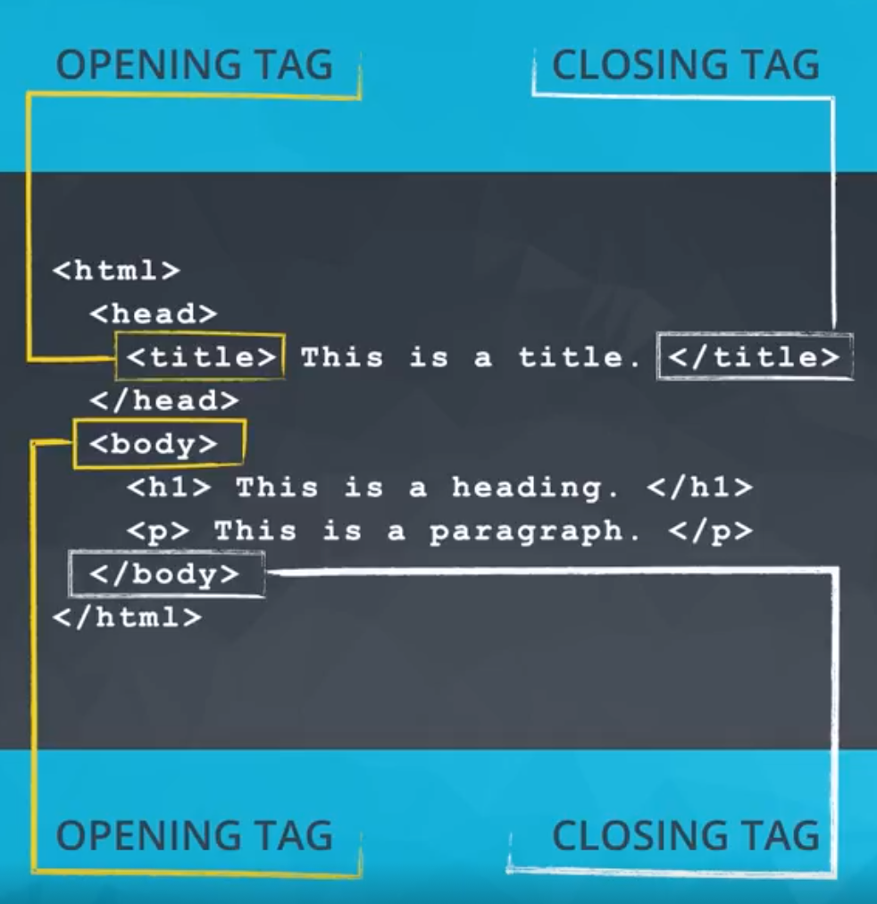

[TOC]

# 资料来源

## 内部文件

- [Rotten Tomatoes：前 100 部热门电影 TSV 文件](https://raw.githubusercontent.com/udacity/new-dand-advanced-china/master/数据清洗/bestofrt.tsv)
  - TSV: Tab Separated Values

> 注：可以编程的方式从某些公司的文件存储系统（如 Google Drive）下载一些数据库的内部数据，但这通常比下载网页上托管的文件麻烦一些。但在实际操作中，通常不以编程方式下载内部文件，用于整理和分析/可视化/建模。

## Web文件抓取

- HTML(HYPERTEXT MARKUP LANGUAGE)

  - 超文本标记语言

- 由TAG组成，TAG为网页提供结构

  

### Python解析器访问HTML

- [Beautiful Soup](https://www.crummy.com/software/BeautifulSoup/)
- [Rotten Tomatoes: E.T. 外星人 (1982)](https://www.rottentomatoes.com/m/et_the_extraterrestrial)

# 平面文件结构

- 构成

1. 纯文本
2. 每行一条记录
3. 每行有若干字段
4. 每个字段用分隔符隔开
   - 逗号(commas)是最常用的
   - Tab, 空格, 甚至是分号

- 优点

  - 
    属于文本文件，因此可以读取。
  - 轻巧。
  - 简单易懂。
  - 可以读/写文本文件的软件随处可见，如文本编辑器。
  - 特别适用于小型数据集。

- 缺点

  例如与关系数据库相比，包括：

  - 缺乏标准。
  - 数据冗余。
  - 共享数据可能很麻烦。
  - 不太适用于大型数据集。

- Python中的平面文件

  ```Python
  import pandas as pd
  pd.read_csv('bestofrt.tsv', sep='\t')
  ```

  

扩展信息：

- [教授 Excel：XML 和 ZIP：浏览你的 Excel 工作簿文件结构](http://professor-excel.com/xml-zip-excel-file-structure/)
- [Cornell：关系数据库 - 非父系平面文件](https://www.cac.cornell.edu/education/Training/DataAnalysis/RelationalDatabases.pdf)

- [pandas：平面文件功能](https://pandas.pydata.org/pandas-docs/stable/api.html#flat-file)


