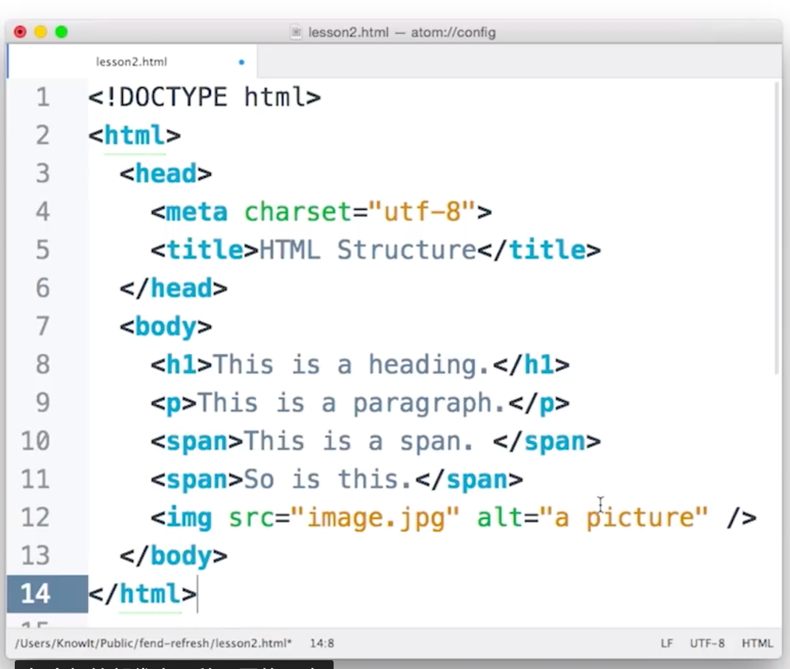
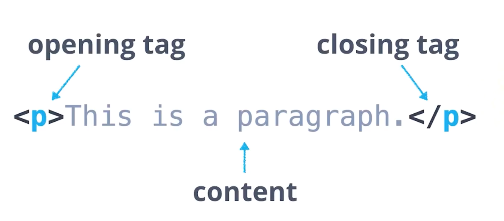
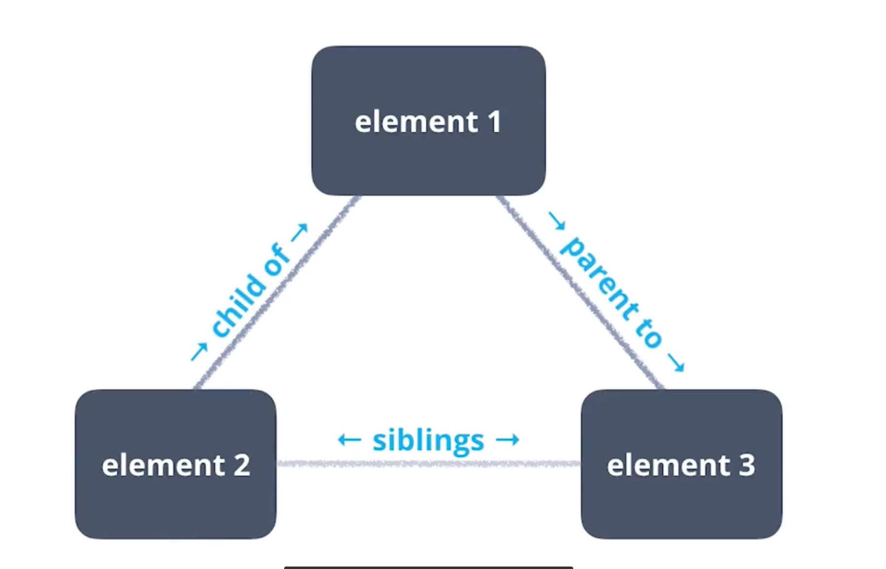

[TOC]

# 资料来源

## 内部文件

- [Rotten Tomatoes：前 100 部热门电影 TSV 文件](https://raw.githubusercontent.com/udacity/new-dand-advanced-china/master/数据清洗/bestofrt.tsv)
  - TSV: Tab Separated Values

> 注：可以编程的方式从某些公司的文件存储系统（如 Google Drive）下载一些数据库的内部数据，但这通常比下载网页上托管的文件麻烦一些。但在实际操作中，通常不以编程方式下载内部文件，用于整理和分析/可视化/建模。

---

## Web文件抓取

### HTML简介

- HTML(HYPERTEXT MARKUP LANGUAGE)

  - 超文本标记语言

- 由TAG组成，TAG为网页提供结构

  
  - \<h1>代表1级标题(heading)
  - \<p>代表段落(paragraph)
  - \<image >没有结束标签


- 树🌲

  
  - ```HTML
    <div>
      <h1>Article Title</h1>
    </div>
    <!-- \<div> division区域元素 -->
    ```

    - 元素(element)中的内容(content)可以是其他元素

    - 表示\<h1>是\<div>的子元素

### Python解析器访问HTML

1. 保存在计算机中

   ```Python
   import requests
   url = 'https://movie.douban.com/subject/24733428/'
   response = requests.get(url)
   
   # Save HTML to file
   with open('心灵奇旅(豆瓣).htm', mode='wb') as file:
     file.write(response.content)
   ```

2. 驻留在计算机内存中

   ```Python
   import requests
   url = 'https://movie.douban.com/subject/24733428/'
   response = requests.get(url)
   
   # Work with HTML in memory
   from bs4 import BeautifulSoup
   soup = BeautifulSoup(response.content, 'lxml') # 'lxml'是指定的解析器
   ```

- 查找

  - .find()

  ```Python
  soup.find('title')
  ```

  - .contents / .children

  ```Python
  # 返回一个tag所有的children列表
  soup.find('title').contents
  ```

  > ```Python
  > 'E.T. The Extra-Terrestrial\xa0(1982)'
  > # xa0表示不间断的Unicode编码
  > ```

- 创建pandas DataFrame
  1. 创建一个空列表 *df_list*，并附加字典。这个词典列表最终将被转换为 pandas DataFrame（这是 [逐行构建 DataFrame 的最有效方式](https://stackoverflow.com/a/28058264))。
  2. 通过 *rt_html* 文件夹中每个电影的 Rotten Tomatoes HTML 文件循环播放。
  3. 打开每个 HTML 文件，并将其传达到一个名为 *file* 的文件句柄中。
  4. 通过使用 [`pd.DataFrame` 构造函数](https://pandas.pydata.org/pandas-docs/stable/generated/pandas.DataFrame.html) 转换 *df_list* 来创建名为 *df* 的 DataFrame。

  ```Python
  from bs4 import BeautifulSoup
  import os
  import pandas as pd
  from tqdm import tqdm # 迭代器显示进度
  
  # 字典列表可以逐个创建文件，随后转化为一个 DataFrame
  # Step.1
  df_list = [] 
  folder = 'rt_html'
  # Step.2
  for movie_html in tqdm(os.listdir(folder)): 
  		# Step.3
      with open(os.path.join(folder, movie_html)) as file: 
          soup = BeautifulSoup(file, 'lxml')
          title = soup.find('title').contents[0][:-len(' - Rotten Tomatoes')]
          audience_score = soup.find('div', class_='audience-score meter').find('span').contents[0][:-1]
          number_of_audience_ratings = soup.find('div', class_='audience-info hidden-xs superPageFontColor')
          num_audience_ratings = number_of_audience_ratings.find_all('div')[1].contents[2].strip().replace(',', '')
          # 注释：正确操作需要花费 ~15 秒运行
          
          # Step.4
          # 添加到字典列表中
          df_list.append({'title': title,
                        'audience_score': int(audience_score),
                          'number_of_audience_ratings': int(num_audience_ratings)})
  df = pd.DataFrame(df_list, columns = ['title', 'audience_score', 'number_of_audience_ratings'])
  ```
  
  - 在写循环时，先打印出一次循环结果然后break查看输出结果
  - 可以使用tqdm显示迭代进度
  
- Tableau可视化

[Best of Rotten Tomatoes: Critic vs. Audience Scores](https://public.tableau.com/profile/david.venturi#!/vizhome/BestofRottenTomatoesCriticvs_AudienceScores/BestofRottenTomatoesCriticvs_AudienceScores)

### 更多信息

-  [Requests库](http://docs.python-requests.org/en/master) 
- [Beautiful Soup](https://www.crummy.com/software/BeautifulSoup/)
- [搜索树](https://www.crummy.com/software/BeautifulSoup/bs4/doc/#searching-the-tree)
-  [tqdm](https://github.com/tqdm/tqdm)
- [Stack Overflow：Beautiful Soup 和 Unicode 问题](https://stackoverflow.com/questions/19508442/beautiful%20-soup-and-unicode-problems)
- [Stack Overflow：Python：删除字符串中的 \ xa0](https://stackoverflow.com/questions/10993612/python-removing-xa0-from-string)
- [Rotten Tomatoes: E.T. 外星人 (1982)](https://www.rottentomatoes.com/m/et_the_extraterrestrial)
- [面向数据科学：Web 抓取数据的伦理](https://medium.com/towards-data-science/ethics-in-web-scraping-b96b18136f01)
- [David Venturi：屏幕抓取是第一个让我对编程感兴趣的“神奇”功能](https://twitter.com/venturidb/status/734757220525715456) 

---

## 从互联网下载文件

- HTTP ( HyperText Transfer Protocol, 超文本传输协议)
- requests库

### 下载

```Python
import requests
import os

folder_name = 'ebert_reviews'
# 如果不存在文件夹则先创建
if not os.path.exists(folder_name):
	os.mkdir(folder_name)

url = 'xxx/xxx.txt'
response = requests.get(url)

with open(os.path.join(folder_name,
                       url.split('/')[-1]), mode='wb') as file: # Write Binary 
  file.write(response.content)

os.listdir(folder_name) # 查看是否下载成功
```

> <Response [200]> # 200表示请求的HTTP状态代码 已成功

### 打开

```Python
# 使用os
import os
folder = 'ebert_reviews'
for ebert_review in os.listdir(folder):
    with open(os.path.join(folder, ebert_review), encoding='uft-8') as file:
```

```Python
# 使用glob
# glob允许使用Unix风格的路径名模式扩展(即可以使用通配符啦!)
import glob
for ebert_review in glob.glob('ebert_reviews/*.txt'):
	with open(ebert_review, encoding='uft-8') as file: # glob直接带相对路径，不用搞os那一套
```

### 转换为df

```Python
import glob
df_list = []
for ebert_review in glob.glob('ebert_reviews/*.txt'):
    with open(ebert_review, encoding='utf-8') as file:
        title = file.readline()[:-1] # readline只读取一行
        review_url = file.readline()[:-1] # 接着读下一行
        review_text = file.read()[:-1] # 接着读剩下的 
        
        df_list.append({'title': title,
                        'review_url': review_url,
                        'review_text': review_text
                       })
df = pd.DataFrame(df_list, columns = ['title', 'review_url', 'review_text'])
```

### 更多信息

- 我们在这个示例中下载了一个文本文件。二进制文件(例如图像)是最好读取和写入 [其他方式](http://docs.python-requests.org/en/latest/user/quickstart/#binary-response-content) 的文件。
- [StackOverflow: 使用 Python 时，这个代码中的 'wb' 是什么意思?](https://stackoverflow.com/questions/2665866/what-is-the-wb-mean-in-this-code-using-python)

- [requests文档](http://docs.python-requests.org/en/master/)供你参考。这相对于类似的库，如 [urllib](https://docs.python.org/3/howto/urllib2.html)来说更清楚一些。
- [Stack Overflow：在 Python 中打开文件的最佳方法](https://stackoverflow.com/a/22288895)
- [Stack Overflow：准确且完全 Pythonic 化的文件读取方式](https://stackoverflow.com/a/8010133)
- [Stack Overflow：迭代与迭代器](https://stackoverflow.com/a/16994568)
- [Wikipedia: Glob编程](https://en.wikipedia.org/wiki/Glob_(programming))

---

## APIs

Application Programming Interfaces

- MediaWiki 广受欢迎的开源API

### MediaWiki API

MediaWiki 的网站上有一个很好的 [tutorial](https://www.mediawiki.org/wiki/API:Main_page#A_simple_example)，是关于他们的 API 调用是如何组织的。这是一个很好的简单例子，解释了各种移动部分：

- 端点 *（重要的经验：这个 URL 没有什么特别的）*
- 格式
- 动作
- 特定动作的参数

### wptools 库

MediaWiki 有一堆不同的访问库，可以满足当前的各种编程语言。这是 Python 的 [列表](https://www.mediawiki.org/wiki/API:Client_code#Python)。这对于大多数 API 都比较标准。一些库比其他库更好一点，但也是标准的。对于 MediaWiki，Python 中最新和可读的库是 [wptools](https://github.com/siznax/wptools)。Twitter 的类似关系是：

- MediaWiki API → wptools
- Twitter API → tweepy

```Python
import wptools

page = wptools.page('SpaceX', lang='zh')
page.get()

page.data

page.data['image']
```

### JSON文件结构

JSON( Javascript Object Notation)

XML( eXtensible Markup Language)

- JSON对于展现和读取具有复杂结构的数据特别有用
- JSON对象
  - `{"Directed by": "Steven", "Release": [{"Data": "May 26, 1982", "Location": "Cannes"}, {"Data": "June 11, 1982", "Location": "United States"]}`
- JSON数组，如上述"Release"


#### 更多信息

- [Udacity - Youtube：Android 开发人员眼中的 JSON](https://www.youtube.com/watch?v=0IOCgHrTJGU)
- [Mashery：API 数据交换：XML 与 JSON](https://www.tibco.com/blog/2014/01/23/api-data-exchange-xml-vs-json/)

---

# 平面文件结构

- 构成

1. 纯文本
2. 每行一条记录
3. 每行有若干字段
4. 每个字段用分隔符隔开
   - 逗号(commas)是最常用的
   - Tab, 空格, 甚至是分号

- 优点

  - 
    属于文本文件，因此可以读取。
  - 轻巧。
  - 简单易懂。
  - 可以读/写文本文件的软件随处可见，如文本编辑器。
  - 特别适用于小型数据集。

- 缺点

  例如与关系数据库相比，包括：

  - 缺乏标准。
  - 数据冗余。
  - 共享数据可能很麻烦。
  - 不太适用于大型数据集。

- Python中的平面文件

  ```Python
  import pandas as pd
  pd.read_csv('bestofrt.tsv', sep='\t')
  ```

  

扩展信息：

- [教授 Excel：XML 和 ZIP：浏览你的 Excel 工作簿文件结构](http://professor-excel.com/xml-zip-excel-file-structure/)
- [Cornell：关系数据库 - 非父系平面文件](https://www.cac.cornell.edu/education/Training/DataAnalysis/RelationalDatabases.pdf)

- [pandas：平面文件功能](https://pandas.pydata.org/pandas-docs/stable/api.html#flat-file)

---

# 文本文件结构

## 介绍

1. 不含有任何格式，如粗体斜体
2. 没有媒体功能，没有图像音频
3. 在Python中，文本行尾采用换行符或反斜线分隔，这些字符在大部分文本编辑器中不可见

## 编码和字符集

[绝对最低要求，每个软件开发人员必须完全主动了解 Unicode 和字符集(没有借口！)](https://www.joelonsoftware.com/2003/10/08/the-absolute-minimum-every-software-developer-absolutely-positively-must-know-about-unicode-and-character-sets-no-excuses/)

摘录：

> **一个最重要的编码要点**

> 不知道字符串使用什么编码，那么字符串就没有任何意义。我们要重视这个问题，不能装作“普通”文本就是 ASCII。

> **There Ain’t No Such Thing As Plain Text.**

> 如果内存、文件或电子邮件中有一个字符串，就必须知道它是什么编码，或者如果不能解释，那么就不能将其正确地呈现给用户。

> 几乎可以将每个愚蠢的问题，例如“我的网站看起来乱七八糟”，或者“带有重音符号时，她无法读取我的电子邮件”归结为程序员太天真，他不明白一个简单的事实，如果不告诉我是否使用 UTF-8 或 ASCII 或 ISO 8859-1(拉丁文 1)或 Windows 1252(西欧)对特定的字符串进行编码，就根本无法正确显示这个字符串，甚至不知道它在哪里结束。编码和大于代码点 127 的代码有上百个，所以很难预测。

历史：

1. [EBCDIC](https://zh.wikipedia.org/wiki/EBCDIC)
2. [ASCII](http://www.robelle.com/library/smugbook/ascii.html)
3. [Code page](https://zh.wikipedia.org/wiki/%E4%BB%A3%E7%A0%81%E9%A1%B5)
4. [Unicode](http://www.unicode.org/)
5. [UTF-8](http://www.utf-8.com/)

[处理文本时，每个程序员必须完全主动了解编码和字符集](http://kunststube.net/encoding/)

> Joel Spolsky 的文章《绝对最低要求，每个软件开发人员必须完全主动了解 Unicode 和字符集(没有借口！)》对这进行了具体介绍，我非常喜欢每隔一段时间阅读一下。但我还是不太愿意向在理解编码方面有困难的人们推荐这个文章，尽管读起来很轻松，但他对实际技术细节并未做过多分析。我希望这篇文章可以更清楚地说明编码是什么，以及为什么在最不需要文本时，将所有文本搞得一团糟。

> …

> **TL;DR**(Too Long, Don't Read)

> 在许多不同的位序列中，可以对任何字符进行编码，任何特定位序列可以表示许多不同的字符，但这取决于使用哪种编码来读取或写入这些字符。原因是不同的编码对每个字符使用不同的位数，以及不同的值来表示不同的字符。”

## Unicode 和 Python

在 Python 3 中：

- 一个文本类型：`str`，具有 Unicode 数据
- 两个字节类型：`bytes` 和 `bytearray`

[此处](https://stackoverflow.com/questions/6224052/what-is-the-difference-between-a-string-and-a-byte --string)很好地解释了不同的用例。

## 更多信息

- 如果仍然对字符集和编码之间的区别感到困惑，可以查阅以下文章：
- [UTF-8 与 Unicode 之间的区别](http://www.polylab.dk/utf8-vs-unicode.html)
- [更多关于 Python 2 和 3 中 Unicode 的内容](http://lucumr.pocoo.org/2014/1/5/unicode-in-2-and-3/)