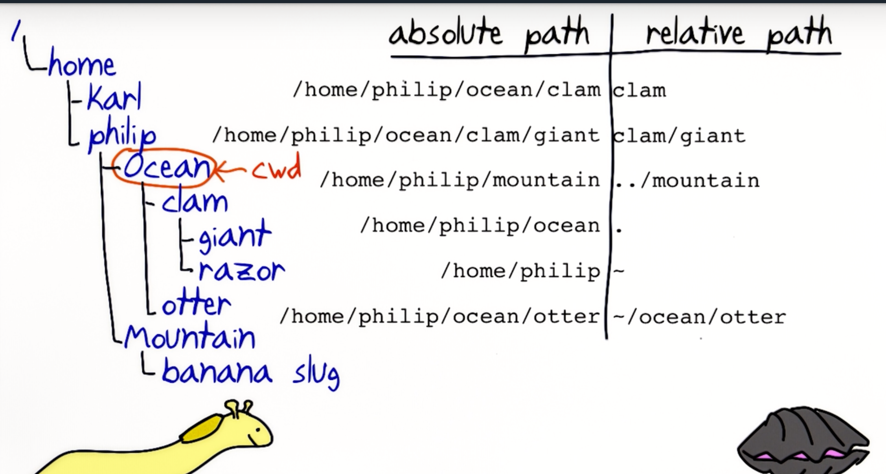

[TOC]

# LINUX COMMAND LINE BASICS

## Package Management

[Debian and Ubuntu](https://www.digitalocean.com/community/tutorials/ubuntu-and-debian-package-management-essentials)

---

## COWSAY

**Ubuntu and Debian users:** `sudo apt-get install cowsay`

**Redhat and CentOS users:** `sudo yum install cowsay`

**OS X users:** `brew install cowsay`

(This requires the homebrew, a third party package manager for OS X, http://brew.sh/)

**Arch Linux users:** `sudo pacman -S cowsay`

---

## Some Common Commands

- `Ctrl+R` 搜索使用过的命令
- `cat` 常用于读取短文件，也能拼接多个文件并显示

- `Tab` 键自动补全

- `man cowsay` Manual 使用手册

## 交互式操作

- `ping` `Ctrl+C`
  - `sort` `Ctrl+D`
- `nano xxx` 编辑

## Path 路径

- Absolute Paths
- Relative Paths
  - 不以`/`开头
  - `../mountain`
  - `clam/giant`

## 文件操作

- `mv`
- `cp`
- `mkdir`
- 通配符
  - `{}`
    - 匹配大括号中的备选字符列表
  - `*`
    - 可以匹配0个字符
  - `?`
    - 1个问号匹配1个字符
  - []
    - 匹配括号中的任意一个字符