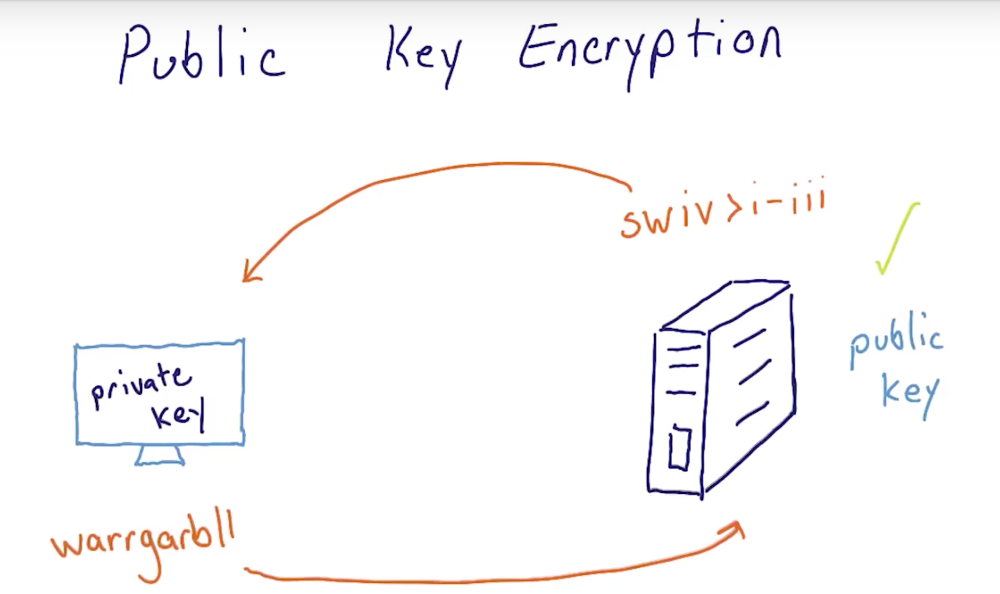

[TOC]

# Intro

## Distributions

- Red Hat Enterprise Linux
  - 企业用户
  - Not Free
- ubuntu
  - 对软件提供一致更新

- Debian
  - 以==稳定性==和==可靠性==出名
    - Debian的名称是由他当时的女友（现在为其前妻[[13\]](https://zh.wikipedia.org/wiki/Debian#cite_note-13)）**Deb**ra和**Ian** Murdock自己的名字合并而成的，所以Debian一词是根据这两个名字在[美国英语](https://zh.wikipedia.org/wiki/美國英語)的发音而读作/'dɛbiːjən/。[[14\]](https://zh.wikipedia.org/wiki/Debian#cite_note-14) （笑😊
  - 更新周期长
  - 是ubuntu的父发行版(parent distribution)
- CoreOS

[Distro](https://distrowatch.com/)  免费开源操作系统新闻

## Important Directories

- `home` 存放每个用户的所有文件
- `etc` 存储配置文件
- `var` 存储可变文件(随着时间变化会改变大小，如缓存文件)
- `bin` 存储可执行的 `二进制文件`
- `sbin` 与`bin`类似，只能由路由用户(route user)用于系统管理和维护
- `lib` 存储支持系统中存储的二进制文件的库
- `usr` 存储用户程序

## `$PATH`

- `echo $PATH`
  - `:`分隔，先从从第一个路径查找可执行文件
- [AskUbuntu: How to Update $PATH](http://askubuntu.com/questions/60218/how-to-add-a-directory-to-my-path)
- [Linux环境变量设置](https://www.jianshu.com/p/38d6ae3f911b)

# Security

## **最重要的安全性规则**

- ***==最小权限规则==***
- (The Rule of Least Privilege)

## ==强烈建议== 

- 设置新服务器时，禁用以root身份远程登陆
- 以自己创建的用户身份登陆

## `sudo`

- 不用`su`被视为最佳做法

## Package Source Lists

- 类似AppStore
- 位于`/etc/apt/sources.list`

## Update

- 确保系统安全==最重要且最简单==的方式之一

###  `sudo apt-get update` 更新软件包

### `sudo apt-get upgrade` 更新已安装的软件

- 先在非生产环境下测试每个操作

- Other Package Related Tasks
  - `sudo apt-get autoremove` 自动删除不需要的软件包
  - `sudo apt-get install finger` 安装名为'finger'的软件包
## Discovering Packages

  - [Ubuntu](https://packages.ubuntu.com/)

  - [Debian](https://www.debian.org/distrib/packages)

## `/etc/passwd`

- `root:x:0:0:root:/root:/bin/bash` 
  - 用户名: username
  - 加密过的密码: password
  - 用户ID: UID
    - the user’s ID number in the system. 0 is root, 1-99 are for predefined users, and 100-999 are for other system accounts
  - 组ID: GID 
  - 更多说明: user ID info
  - 用户主目录: home directinary
  - 用户默认shell: command/shell

## Creating a New User

  - `sudo adduser season`

## Connecting as the New User

- `ssh [username]@[ip address] -p [port] `
  
  - 127.0.0.1 标准IP地址，始终代表本地主机或当前所在的同一计算机
  
  - 长时间未响应，输入`~.` 终止ssh连接
- `sudo cat /etc/sudoers` 查看有权使用sudo的用户
- 直接用visudo编辑，但是版本升级会覆盖此文件，造成用户丢失
  - 通过编辑`/etc/sudoers.d`目录内的文件添加sudo用户
  
- `touch season`/`cat > season`/`echo > season`
    - `season ALL=(ALL) NOPASSWD:AL`

## [sudo: command not found](https://unix.stackexchange.com/questions/354928/bash-sudo-command-not-found)

- By default sudo is not installed on Debian, but you can install it. First enable su-mode:
  `su -`

  Install sudo by running:
  `apt-get install sudo -y`

## sudo: unable to resolve host xxx

- 通常更改主机名后会遇到此错误
- `sudo nano /etc/hosts`
  - 添加`127.0.0.1	xxx `
  - 或者将旧的主机名改为新的主机名

## Resetting Passwords

- `sudo passwd -e season`
  - -e 强制下次登录重设密码

## Key Based Authentication

==永远不要与任何人共享私有密匙==

==私有密匙应始终牢牢掌握在自己手中==

因此，始终==在本地生成密匙对==

1. [生成新 SSH 密钥并添加到 ssh-agent](https://docs.github.com/cn/free-pro-team@latest/github/authenticating-to-github/generating-a-new-ssh-key-and-adding-it-to-the-ssh-agent)

   `ssh-keygen` ==在本地计算机运行，详情可查看上述链接==

   xxx.pub 相当于锁

   xxx 相当于钥匙

2. 把锁传给远程Linux服务器

   1. `mkdir .ssh` 

   2. `touch .ssh/authorized_keys`

   3. `cat .ssh/xxx.pub`

      **本地**复制xxx.pub的文本内容

   4. `nano .ssh/authorized_keys`

      粘贴复制的内容

   5. `chmod 700 .ssh`

      `chmod 644 .ssh/authorized_keys`

      更改目录及文件权限

3. 使用密匙登陆

   `ssh [name]@[ip address] -p [port] -i ~/.ssh/[name of key]`

## Public Key Encryption

1. 远程服务器发送信息给本地计算机
2. 本地计算机使用私有密匙将==加密后的信息==回复给远程服务器
3. 远程服务器使用公共密匙解密收到的信息，如果==解密后的值==与发送的值相等，验证通过

