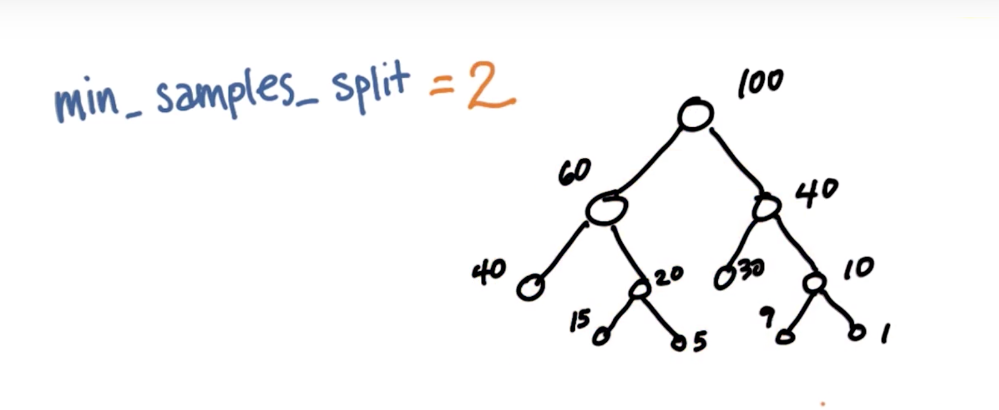

[TOC]

## 机器学习应用场景

- 物理学家梳理庞大数据集
- Netflix推荐
- 信用卡防欺诈
- Google搜索服务
- 语音识别
- Google翻译
- 服装推荐
- 自动驾驶

## 监督分类

- 特征 FEATURE

  > 输入特征数据，如音乐的强度，歌曲节奏，音乐流派，声音性别等

- 标签 LABELS

  > 提取特征生成标签
  >
  > 比如对音乐的特征分为 喜欢 or 不喜欢

- 决策面 Decision Surface, D.S.

  > 例如 分界线--线性决策面 LINEAR

机器学习要做的事情是

> DATA $\Rightarrow$D.S.

## scikit-learn A.K.A. sklearn

1. Google "sklearn + 算法名称"

   > eg. Sklearn Naive Bayes

2. 进入文档查看

   1. import 导入外部模块

    ```Python
   from sklearn.naive_bayes import GaussianNB
    ```

   2. 实例化 创建分类器

   ```Python
   clf = GaussianNB()
   ```

   3. 拟合 fit (训练 train)

   ```Python
   clf.fit(X, Y)
   ```

   4. 预测

   ```Python
   print(clf.predict([[-0.8, -1]]))
   ```

   5. 评分

   ```Python
   from sklearn.metrics import accuracy_score
   accuracy_score(pred, labels_test)
   ```

   ​	or

   ```Python
   print clf.score(pred, labels_test)
   ```

## 区分训练集与测试集

- 过拟合：

  > 模型高估了自己对所有情况的了解程度

- 泛化分类器

  > 使模型能够识别某些方面存在差别的新数据

- 永远保留大约10%的数据，用作测试集

  - features_train, labels_train;
  - features_test, labels_test

## 朴素贝叶斯

- Naive Bayes (蛤丝狂喜)

- 为什么Naive

  - 忽略了顺序

- 优点

  - 容易执行
  - 特征空间非常大时效率高

- 缺点

  - 忽略了顺序
  - 当年Google"Chicago Bulls"会出现公牛和芝加哥的图片，而不是球队

- 知名案例

  > ### 针对作者身份的机器学习
  >
  > 几年前，J.K. 罗琳（凭借《哈利波特》出名）试着做了件有趣的事。她以 Robert Galbraith 的化名写了本名叫《The Cuckoo’s Calling》的书。尽管该书得到一些不错的评论，但是大家都不太重视它，直到 Twitter 上一个匿名的知情人士说那是 J.K. Rowling 写的。《伦敦周日泰晤士报》找来两名专家对《杜鹃在呼唤》和 Rowling 的《偶发空缺》以及其他几名作者的书进行了比较。[分析结果](http://languagelog.ldc.upenn.edu/nll/?p=5315)强有力地指出罗琳就是作者，《泰晤士报》直接询问出版商情况是否属实，而出版商也证实了这一说法，该书在此后一夜成名。

- Mini Project

  > 我们也将在此项目中做类似的事。我们有一组邮件，分别由同一家公司的两个人撰写其中半数的邮件。我们的目标是仅根据邮件正文区分每个人写的邮件。在这个迷你项目一开始，我们将使用朴素贝叶斯，并在之后的项目中扩展至其他算法。
  >
  > 我们会先给你一个字符串列表。每个字符串代表一封经过预处理的邮件的正文；然后，我们会提供代码，用来将数据集分解为训练集和测试集（在下节课中，你将学习如何进行预处理和分解，但是现在请使用我们提供的代码）。
  >
  > 朴素贝叶斯特殊的一点在于，这种算法非常适合文本分类。在处理文本时，常见的做法是将每个单词看作一个特征，这样就会有大量的特征。此算法的相对简单性和朴素贝叶斯独立特征的这一假设，使其能够出色完成文本的分类。在这个迷你项目中，你将在计算机中下载并安装 sklearn，然后使用朴素贝叶斯根据作者对邮件进行分类。
  - 安装 sklearn: ***pip install scikit-learn***
  - 安装自然语言工具包：***pip install nltk***
  
- 对NB分类器***计时***

  > t0 = time()
  > < 你的 clf.fit() 代码行 >
  > print "training time:", round(time()-t0, 3), "s"

## 支持向量机 SVM 

- Support Vector Machines
- MARGIN-间隔
  - 最大化到不同分类最近点的距离

- SVM首先保证分类正确
  - 在此前提下最大化MARGIN
- 异常值会被忽略
- CODE:

```Python
from sklearn.svm import SVC

clf = svm.SVC()
# clf = SVC(kernel="line")

clf.fit(features_train, labels)

pred = clf.predict(features_test)

accuracy_score(pred, labels_test)
```

- 核技巧(KERNEL TRICK)

  > 一个函数，接收低维度的输入空间或特征空间，将其映射到高维度空间 
  - 将过去不可线性分割(NOT LINEAR SEPARABLE)的内容变为可分割
  - kernels 核函数，实现非线性分割线对数据集进行分类

- Parameters参数

  > 创建分类器时设置的参数（实参）

  - kernel
  - $\gamma$
  - C，一个更大的 C 会得到更多正确的训练点，边界更复杂；但是有可能会过拟合

- 过拟合(Over Fitting)

- 优缺点：

  - 对于有明显分隔边界的复杂数据效果很好
  - 对于海量数据表现不好
    - 训练时间与数据量的三次方成正比
  - 数据集噪声过大情况下SVM效果也不好
  - 如果类之间的重叠较多使用Naive Bayes效果更好

## 决策树

```Python
from sklearn import tree
clf = tree.DecisionTreeClassifier()
clf = clf.fit(X, Y)
clf.predict(X_test)
```

- Parameters

  - min_samples_split 决定能够继续分割的最小分割样本，如图最右边的1<2所以不再继续分割

- Entropy 熵

  - 决定决策树在何处分隔数据

  - $$
    Entropy=-\sum_ip_i\log_2(p_i)
    $$

    - $p_i$是第i类中的样本占总样本数的比例
    - 只有1类，熵=0
    - 样本均匀分到所有类中，熵=1
    - 熵越大表明此分类单一性最差，越小表明分类效果越好

- [[Python计算]]

  - ```Python
    import math
    math.log(0.5, 2)# 第二个参数是对数的底数
    ```

- Information Gain 信息增益
  - $$
    IG=Entropy(Parent)-[Weighted Average]Entropy(Children)
    $$

  - 决策树算法会Maxmize IG

- Bias-Variance 偏差-方差

- 优缺点

  - 容易过拟合，特别是包含大量特征数据时

## random forest

## adaboost

