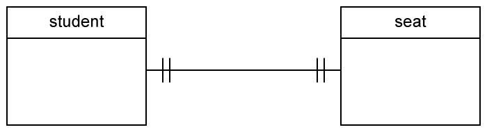
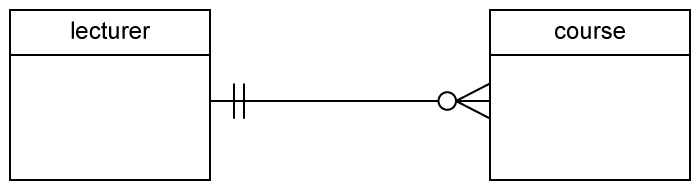
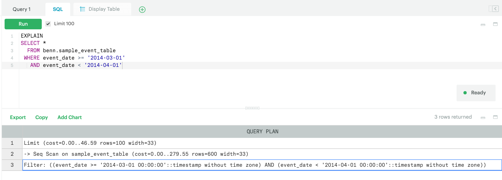

[TOC]

# SQL

## 实体关系图ERD

[来源](https://mode.com/) (parch_and_posey)


- 可以通过 ["crow's foot" 表示法](http://www.vertabelo.com/blog/technical-articles/crow-s-foot-notation)来标记出一个表格里的列与另一个表格的列之间的关联，比如 region 表格里的 `id` 对应 sales_rep 表格里 `region_id`。
  - Relationships have two indicators. These are shown on both sides of the line.

    - The first one (often called **multiplicity**) refers to the *maximum* number of times that an instance of one entity can be associated with instances in the related entity. It can be **one** or **many**.

      

      

    - The second describes the *minimum* number of times one instance can be related to others. It can be **zero** or **one**, and accordingly describes the relationship as **optional** or **mandatory**.

      

      

- One-to-one

  

- One-to-many

  

- Many-to-many

  

## 键

### 主键 (PK)

**主键**是特定表格的唯一列。在我们的每个表格中是第一列，并且这些列都叫做 **id**，但是并非必须都要这样。**通常，在大多数数据库中，主键是表格的第一列。**

### 外键 (FK)

**外键**是另一个表格中的主键。

## 数据库类型

- SQL数据库

  - 一些最受欢迎的数据库包括：:
  1. MySQL
    2. Access
    3. Oracle
    4. Microsoft SQL Server
    5. Postgres
  
  [这里](https://www.digitalocean.com/community/tutorials/sqlite-vs-mysql-vs-postgresql-a-comparison-of-relational-database-management-systems) 的文章比较了三种最常见的 SQL 类型：SQLite、PostgreSQL 和 MySQL。
  
- Non-SQL数据库

  - [MongoDB](https://classroom.udacity.com/courses/ud032)

## 数据库规范化

在创建数据库时，一定要思考下将如何存储数据。这称为**规范化**，是大多数 SQL 课程的一个重要组成部分。如果你负责设置新的数据库，则需要详细了解数据库**规范化**。

数据库规范化需要考虑以下三个要点：

1. 表格存储了逻辑分组的数据吗？
2. 我能在一个位置进行更改，而不是在多个表格中对同一信息作出更改吗？
3. 我能快速高效地访问和操纵数据吗？

[这篇文章](http://agiledata.org/essays/dataNormalization.html)详细讲解了上述内容。

## 格式

### 大写

你可能已经注意到，我们大写了 SELECT 和 FROM，而将表和列名称小写。这是一个常见的格式惯例。大写命令（SELECT、FROM），小写查询中的其他内容是常见做法。这使得查询更容易读取，这在编写更复杂的查询时更为重要。准备编写查询时，这是一个很好的习惯。

### 表和变量名中不需要空格

通常在列名中使用下划线，避免使用空格。 在 SQL 中使用空格有点麻烦。 在 Postgres 中，如果列或表名称中有空格，就需要使用双引号括住这些列/表名称（例如：FROM "Table Name"，而不是 FROM table_name）。在其他环境中，可能会使用方括号（例如：FROM [Table Name]）。

### 在查询中使用空格

SQL 查询忽略空格，因此可以根据需要在代码之间添加尽可能多的空格和空行，并且查询结果是相同的。我们来看下面这个查询

```
SELECT account_id FROM orders
```

等价于这个查询:

```
SELECT account_id
FROM orders
```

和这个查询（但是不要这样写，不符合规范，而且太丑了）:

```
SELECT              account_id

FROM               orders
```

### SQL 不区分大小写

如果你已经使用过其他语言编程，那么可能会熟悉编程语言，如果没有区分大小写键入正确的字符，那么会非常麻烦。 SQL 不区分大小写。 我们来看看下面的查询：

```
SELECT account_id
FROM orders
```

和这个相同：

```
select account_id
from orders
```

也和这个相同：

```
SeLeCt AcCoUnt_id
FrOm oRdErS
```

但是，我会再次提醒你遵循上面讲述的完全大写命令的惯例，而将其他代码片段小写。

### 分号

根据 SQL 环境，查询结尾可能需要一个执行的分号。 这个"要求"在其他环境中比较灵活。我们认为在每个语句的末尾添加一个分号是最好的做法，如果环境能够一次显示多个结果，那么这样做还可以一次运行多个命令。

最好的做法：

```
SELECT account_id
FROM orders;
```

因为，我们这里的环境不需要分号，你会看到没有分号的解决方案：

```
SELECT account_id
FROM orders
```

## 单表查询

| **语句** | **用法**                        | **其他详情**                               |
| :------- | :------------------------------ | :----------------------------------------- |
| SELECT   | SELECT **Col1**, **Col2**, ...  | 提供你想要的列                             |
| FROM     | FROM **Table**                  | 提供列存在的表                             |
| LIMIT    | LIMIT **10**                    | 限制返回的行数                             |
| ORDER BY | ORDER BY **Col**                | 根据列对表排序。与 **DESC** 一起使用。     |
| WHERE    | WHERE **Col > 5**               | 用于过滤结果的条件语句                     |
| LIKE     | WHERE **Col LIKE '%me%**        | 仅拉取文本中包含 'me' 的列                 |
| IN       | WHERE **Col IN ('Y', 'N')**     | 仅过滤包含 'Y' 或 'N' 列的行               |
| NOT      | WHERE **Col NOT IN ('Y', 'N')** | **NOT** 经常与 **LIKE** 和 **IN** 一起使用 |
| AND      | WHERE **Col1 > 5 AND Col2 < 3** | 过滤两个或多个条件必须为真的行             |
| OR       | WHERE **Col1 > 5 OR Col2 < 3**  | 过滤至少一个条件必须为真的行               |
| BETWEEN  | WHERE **Col BETWEEN 3 AND 5**   | 通常比使用 **AND** 的语法简单              |

## SQLJOIN

**JOIN** 存储的是表格，**ON** 是让**主键**等于**外键**。

### 别名

```sql
FROM tablename AS t1
JOIN tablename2 AS t2
```

- AS 可省略

### LEFTJOIN

- 国际通用，很少用RIGHT JOIN

- OUTER JOIN 罕见

- **LEFT JOIN ON**后可加**AND**替代**WHERE**语句(相当于在连接前使用WHERE语句，连接了一个只包含了AND筛选后的表)

  - 结果中包含321500和其他销售代表的数据

  ```SQL
  SELECT orders.*,
  			 accounts.*
  	FROM demo.orders
  	LEFT JOIN demo.accounts
  		ON orders.accounts_id = accounts.id
  	 AND accounts.sales_rep_id = 321500
  ```

  - 当数据库执行该查询时，它先执行连接和 **ON** 条件中的指令。将其看做构建新的结果集，然后使用 **WHERE** 条件来过滤该结果集。
  
  - 将此过滤器移到内连接的 **ON** 条件中将与使其保留在 **WHERE** 条件中产生的结果一样。
```SQL
SELECT CASE WHEN investments.investor_name IS NULL THEN 'No Investors'
            ELSE investments.investor_name END AS investor,
       COUNT(DISTINCT companies.permalink) AS companies_invested_in
  FROM tutorial.crunchbase_companies companies
  LEFT JOIN tutorial.crunchbase_investments investments
    ON companies.permalink = investments.company_permalink
 GROUP BY 1
 ORDER BY 2 DESC
```
### [UNION 和 UNION ALL](http://www.sqlservertutorial.net/sql-server-basics/sql-server-union/)

### [CROSS JOIN](http://www.sqlservertutorial.net/sql-server-basics/sql-server-cross-join/)

### [SELF JOIN](http://www.sqlservertutorial.net/sql-server-basics/sql-server-self-join/)

## SQL 聚合

### NULL

- **NULL** 是一种数据类型，表示 SQL 中没有数据
  - 与零或者空格不同，它们表示不存在数据的单元格

- 在 **WHERE** 条件中表示 **NULL** 时，我们写成 **IS NULL** 或 **IS NOT NULL**。我们不使用 `=`，因为 **NULL** 在 SQL 中不属于值。但是它是数据的一个属性。
- 在执行 **LEFT JOIN** 或 **RIGHT JOIN** 时，**NULL** 经常会发生。
- **NULL** 也可能是因为数据库中缺失数据。

***COUNT 会返回包含非空值数据行的计数***

***SUM 会忽略NULL，其他聚合函数也是这样***

***AVG 忽略 NULL，NULL不会记入分子或分母。如果想将 NULL 当做零，则需要使用 SUM 和 COUNT 。但是，如果 NULL 值真的只是代表单元格的未知值，那么这么做可能不太合适***

### GROUP BY

- **GROUP BY** 可以用来在数据子集中聚合数据，多个条件用`,`分隔
- **SELECT** 语句中的任何一列如果不在聚合函数中，则必须在 **GROUP BY** 条件中。即必须都是***折叠（collapse）***后的数据
- **GROUP BY** 始终在 **WHERE** 和 **ORDER BY** 之间。
- **ORDER BY** 有点像电子表格软件中的 **SORT**。

### DISTINCT

- **仅返回特定列的唯一值**的函数。
- 在使用 **DISTINCT** 时，尤其是在聚合函数中使用时，会让查询速度有所减慢。

### HAVING

- 对聚合结果进行筛选
  - 想对通过聚合创建的查询中的元素执行 **WHERE** 条件，就需要使用 **HAVING**。
- 位置在**GROUP BY**之后
  - **WHERE**在**GROUP BY**之前
- **HAVING** 是过滤被聚合的查询的 “整洁”方式，但是通常采用**子查询**的方式来实现

### DATE函数

- **DATE_TRUNC**

  - [PostgreSQL](https://www.postgresql.org/docs/9.1/functions-datetime.html)

  - ```SQL
    SELECT DATE_TRUNC('year', TIMESTAMP '2001-02-16 20:38:40');
    Result: 2001-01-01 00:00:00
    ```

- **DATE_PART**

  - [PostgreSQL](https://www.postgresqltutorial.com/postgresql-date_part/)

  - ```sql
    SELECT DATE_PART('dow', occurred_at) AS day_of_week,
    FROM demo.orders
    ```

### CASE

- CASE 语句始终位于 SELECT 条件中。
- CASE 必须包含以下几个部分：WHEN、THEN 和 END。ELSE 是可选组成部分，用来包含不符合上述任一 CASE 条件的情况。
- 你可以在 WHEN 和 THEN 之间使用任何条件运算符编写任何条件语句（例如 [WHERE](https://community.modeanalytics.com/sql/tutorial/sql-where/)），包括使用 AND 和 OR 连接多个条件语句。
- 你可以再次包含多个 WHEN 语句以及 ELSE 语句，以便处理任何未处理的条件。

  ```SQL
  SELECT id, account_id, CASE WHEN standard_qty = 0 OR standard_qty     IS NULL THEN 0 ELSE standard_amt_usd/standard_qty END AS unit_price
  FROM orders
  LIMIT 10;
  ```


***熟能生巧，不过太长时间都陷在某个问题上也不太合适！***

## 子查询

- 必须设置别名 
  - 跟在HAVING, WHERE后边的加括号不设置别名
- 数据库将子查询视为独立查询
- 外部查询按照外部查询的级别缩进
  - 内部查询按内部查询的级别缩进
- 如果我们返回了整个列，则需要使用 **IN** 来执行逻辑参数。如果我们要返回整个表格，则必须为该表格使用**别名**，并对整个表格执行其他逻辑。

```SQL
SELECT SUM(total_amt_usd)
FROM orders
WHERE DATE_TRUNC('month', occurred_at) =
(SELECT DATE_TRUNC('month', MIN(occurred_at)) FROM orders);
```

## WITH

- **WITH** 语句经常称为**公用表表达式**（简称 **CTE**[^CTE]）

  - [^CTE]:Common Table Expressions

- 在使用 **WITH** 创建多个表格时，需要在每个表格后面加一个逗号，但是在引向最终查询的最后一个表格后面不需添加。

- 后边的WITH语句可以使用前边WITH语句创建的临时表格

- SELECT语句中的HAVING或WHERE后加WITH语句中的表格，需要使用`SELECE * FROM xxx`

```SQL
WITH t1 AS (
SELECT r.name region_name, SUM(o.total_amt_usd) total_amt
FROM sales_reps s
JOIN accounts a
ON a.sales_rep_id = s.id
JOIN orders o
ON o.account_id = a.id
JOIN region r
ON r.id = s.region_id
GROUP BY r.name),

t2 AS (
SELECT MAX(total_amt)
FROM t1)

SELECT r.name, SUM(o.total) total_orders
FROM sales_reps s
JOIN accounts a
ON a.sales_rep_id = s.id
JOIN orders o
ON o.account_id = a.id
JOIN region r
ON r.id = s.region_id
GROUP BY r.name
HAVING SUM(o.total_amt_usd) = (SELECT * FROM t2);
```

## SQL数据清洗

### LEFT 

**LEFT(phone_number, 3)** 获取电话号码中的前三位。

**RIGHT(phone_number, 8)** 获取电话号码的最后 8 位。

### LENGTH

**LENGTH** 提供了特定列每行的字符数。

**LENGTH(phone_number)** 电话号码的长度

### UPPER()

LOWER() 转换大小写

### **POSITION** 

获取字符和列，并提供该字符在每行的索引。第一个位置的索引在 SQL 中是 1。如果你之前学习了其他编程语言，就会发现很多语言的索引是从 0 开始。

**POSITION(',' IN city_state)** 获取逗号的索引。

**STRPOS(city_state, ‘,’)** 作用与POSITION一样，参数位置交换

区分大小写

### CONCAT

拼接

- **CONCAT(first_name, ' ', last_name)**
- 或者使用双竖线：**first_name || ' ' || last_name**。

### REPLACE

> replace( 'abcdefabcdef', 'cd', 'XX')
>
> abXXefabXXef

### CAST

- TO_DATE(month, 'month')
  
- **DATE_PART('month', TO_DATE(month, 'month'))** 将月份名称改成了与该月相关的数字。
  
- **CAST(date_column AS DATE)** 将`字符串`改成`日期`
  - 在[此处](http://www.postgresqltutorial.com/postgresql-cast/)看到其他例子

  - **date_column::DATE**

### TRIM
用来删掉字符串开头和末尾的字符，这样就可以删掉一行开头或末尾的空格，从 Excel 或其他存储系统转移过来的数据经常就需要这么处理。

`trim([leading | trailing | both] [characters] from string)`

> trim(both 'x' from 'xTomxx')
>
> Tom

### SUBSTR

`substr`(`string`, `from` [, `count`])

>substr('alphabet', 3, 2)
>
>ph

### **COALESCE**

返回每行的第一个非 NULL 值

`COALESCE(descript, 'No Description')` 空值替换

在[此处](https://academy.vertabelo.com/blog/5-functions-manipulating-sql-strings/)详细了解这些函数。你还可以在[此处](https://community.modeanalytics.com/sql/tutorial/sql-string-functions-for-cleaning/)查看这节课介绍的很多函数。

### 其他

[ProgreSQL Functions](https://www.postgresql.org/docs/8.1/functions-string.html)

**LEFT**、**RIGHT** 和 **TRIM** 都仅用来选择特定的字符串元素，但是使用它们选择数字或日期元素，系统会将它们处理为字符串。

每一部分按照所学的函数设定标签，便于你复习这些数据清理功能。如果你一开始不习惯使用任何一个函数，这是正常现象，需要练习一段时间才能适应。你完全可以再看一遍这些材料，进一步磨练你的技能！

不需要记住这些功能，但是你需要学会查看文档，并从所执行的查询中学习经验，从而能够解决新的问题。

终于学完了这一部分，你很棒！

## [WindowsFunctions]( https://mode.com/sql-tutorial/sql-window-functions/)

### Intro

> A *window function* performs a calculation across a set of table rows that are somehow related to the current row. This is comparable to the type of calculation that can be done with an aggregate function. But unlike regular aggregate functions, use of a window function does not cause rows to become grouped into a single output row — the rows retain their separate identities. Behind the scenes, the window function is able to access more than just the current row of the query result.

- 在符合条件的行中进行聚合运算
- 类似分组，但不会像分组一样只能返回一个聚合值
- 在常规聚合函数之后执行
- 只能在SELECT语句和ORDER BY语句中使用
  
  - 不能在GROUP BY, HAVING, WHERE语句中使用
- 如果在窗口计算之后需要进行过滤或分组，使用子查询

- 多个窗口函数时设置别名

  > ```SQL
  > SELECT sum(salary) OVER w, avg(salary) OVER w
  >   FROM empsalary
  >   WINDOW w AS (PARTITION BY depname ORDER BY salary DESC);
  > ```

### 🌰

计算每个部门的人员的平均薪资

```SQL
SELECT depname, empno, salary, avg(salary) OVER (PARTITION BY depname) FROM empsalary;
```

```sql
  depname  | empno | salary |          avg          
-----------+-------+--------+-----------------------
 develop   |    11 |   5200 | 5020.0000000000000000
 develop   |     7 |   4200 | 5020.0000000000000000
 develop   |     9 |   4500 | 5020.0000000000000000
 develop   |     8 |   6000 | 5020.0000000000000000
 develop   |    10 |   5200 | 5020.0000000000000000
 personnel |     5 |   3500 | 3700.0000000000000000
 personnel |     2 |   3900 | 3700.0000000000000000
 sales     |     3 |   4800 | 4866.6666666666666667
 sales     |     1 |   5000 | 4866.6666666666666667
 sales     |     4 |   4800 | 4866.6666666666666667
(10 rows)
```

### SUM, COUNT, and AVG

```SQL
SELECT start_terminal,
       duration_seconds,
       SUM(duration_seconds) OVER
         (PARTITION BY start_terminal ORDER BY start_time)
         AS running_total,
       COUNT(duration_seconds) OVER
         (PARTITION BY start_terminal ORDER BY start_time)
         AS running_count,
       AVG(duration_seconds) OVER
         (PARTITION BY start_terminal ORDER BY start_time)
         AS running_avg
  FROM tutorial.dc_bikeshare_q1_2012
 WHERE start_time < '2012-01-08'
```

### ROW_NUMBER()

- Display the number of a given row. It starts are 1 and numbers the rows according to the `ORDER BY` part of the window statement.
- Using the `PARTITION BY` clause will allow you to begin counting 1 again in each partition

```SQL
SELECT start_terminal,
       start_time,
       duration_seconds,
       ROW_NUMBER() OVER (PARTITION BY start_terminal
                          ORDER BY start_time)
                    AS row_number
  FROM tutorial.dc_bikeshare_q1_2012
 WHERE start_time < '2012-01-08'
```

### RANK() and DENSE_RANK()

- RANK() 与ROW_NUMBER() 区别在于相同值处理上
  - ROW_NUMBER() 从1开始依次加1，不会有相同的结果, 如1, 2, 3
  - RANK() 遇到相同的值会给相同的RANK, 如1, 1, 3
- DENSE_RANK()与RANK() 区别在于DENSE_RANK() 不会跳过，如1, 1, 2

### NTILE

- Identify what percentile (or quartile, or any other subdivision) a given row falls into.
- The syntax is `NTILE(*# of buckets*)`
- ORDER BY 决定使用哪一列来确定分位数
- 当数据量n小于使用的参数时会出错，这时应考虑使用更小的参数

```SQL
SELECT start_terminal,
       duration_seconds,
       NTILE(4) OVER
         (PARTITION BY start_terminal ORDER BY duration_seconds)
          AS quartile,
       NTILE(5) OVER
         (PARTITION BY start_terminal ORDER BY duration_seconds)
         AS quintile,
       NTILE(100) OVER
         (PARTITION BY start_terminal ORDER BY duration_seconds)
         AS percentile
  FROM tutorial.dc_bikeshare_q1_2012
 WHERE start_time < '2012-01-08'
 ORDER BY start_terminal, duration_seconds
```

- 设置别名

```SQL
SELECT start_terminal,
       duration_seconds,
       NTILE(4) OVER ntile_window AS quartile,
       NTILE(5) OVER ntile_window AS quintile,
       NTILE(100) OVER ntile_window AS percentile
  FROM tutorial.dc_bikeshare_q1_2012
 WHERE start_time < '2012-01-08'
WINDOW ntile_window AS
         (PARTITION BY start_terminal ORDER BY duration_seconds)
 ORDER BY start_terminal, duration_seconds
```


### LEAD and LAG

- 取前(后)[n]行的值

  ```SQL
  LAG(duration_seconds, 1) OVER
           (PARTITION BY start_terminal ORDER BY duration_seconds) AS lag
  ```

- 使用子查询删除产生的NULL

  ```SQL
  SELECT *
    FROM (
      SELECT start_terminal,
             duration_seconds,
             duration_seconds -LAG(duration_seconds, 1) OVER
               (PARTITION BY start_terminal ORDER BY duration_seconds)
               AS difference
        FROM tutorial.dc_bikeshare_q1_2012
       WHERE start_time < '2012-01-08'
       ORDER BY start_terminal, duration_seconds
         ) sub
   WHERE sub.difference IS NOT NULL
  ```

### 其他函数

[PostgreSQL_Doc](https://www.postgresql.org/docs/8.4/functions-window.html)

## [Performance Tuning SQL Queries](https://mode.com/sql-tutorial/sql-performance-tuning/)

### Intro

[查询运行时背后的理论](https://mode.com/sql-tutorial/sql-performance-tuning/#the-theory-behind-query-run-time)

数据库是在计算机上运行的软件，并且与所有软件一样受到相同的限制-数据库只能处理其硬件能够处理的信息。使查询运行更快的方法是减少软件（以及因此硬件）必须执行的计算数量。为此，您需要对SQL实际进行计算的方式有所了解。首先，让我们解决一些会影响您需要进行的计算数量以及查询运行时间的高级事情：

- **表大小：**如果查询命中具有百万行或更多行的一个或多个表，则可能会影响性能。
- **联接：**如果您的查询以显着增加结果集的行数的方式联接两个表，则您的查询可能会变慢。[子查询课程中](https://mode.com/sql-tutorial/sql-sub-queries#joining-subqueries)有一个示例。
- **聚合：**合并多个行以产生一个结果需要比简单地检索那些行更多的计算。

查询运行时还取决于您无法真正控制的与数据库本身相关的某些事情：

- **其他正在运行查询的用户：**在数据库上并发**运行的查询**越多，数据库在给定时间必须处理的次数就越多，一切运行的速度就越慢。如果其他人正在运行满足上述某些条件的资源特别密集的查询，则可能会特别糟糕。
- **数据库软件和优化：**这可能是您无法控制的，但是如果您知道所使用的系统，则可以在其范围内工作以提高查询效率。

### Reducing table size

- WHERE 筛选数据以仅包含所需的观察值可以大大提高查询速度。您如何执行此操作完全取决于您要解决的问题。例如，如果您有时间序列数据，则将时间窗口限制在一个较小的时间范围内可使查询运行得更快
- LIMIT 请记住，您始终可以对一部分数据执行探索性分析，将工作细化为最终查询，然后消除限制并在整个数据集中运行您的工作。最终查询可能需要很长时间才能运行，但是至少您可以快速运行中间步骤。
  - 但是对于聚合没有帮助，因为会先执行聚合然后LIMIT
  - 可以在子查询中LIMIT然后进行聚合
  - **注意**：使用`LIMIT`此选项将极大地改变您的结果，因此您应该使用它来测试查询逻辑，但不要获取实际结果。

### Making joins less complicated

在JOIN之前执行聚合，减少运算量

```SQL
SELECT teams.conference,
       sub.*
  FROM (
        SELECT players.school_name,
               COUNT(*) AS players
          FROM benn.college_football_players players
         GROUP BY 1
       ) sub
  JOIN benn.college_football_teams teams
  ON teams.school_name = sub.school_name
```

### EXPLAIN

- Add `EXPLAIN` at the beginning of any (working) query to get a sense of how long it will take. It's not perfectly accurate, but it's a useful tool.
- 
  - cost越高运行时间越长
  - 修改cost高的步骤然后EXPLAIN看成本是否降低
- [更多信息](https://www.postgresql.org/docs/9.0/sql-explain.html)

[Pivoting Data in SQL](https://mode.com/sql-tutorial/sql-pivot-table/)

[About Analytics Training](https://mode.com/sql-tutorial/sql-business-analytics-training/)