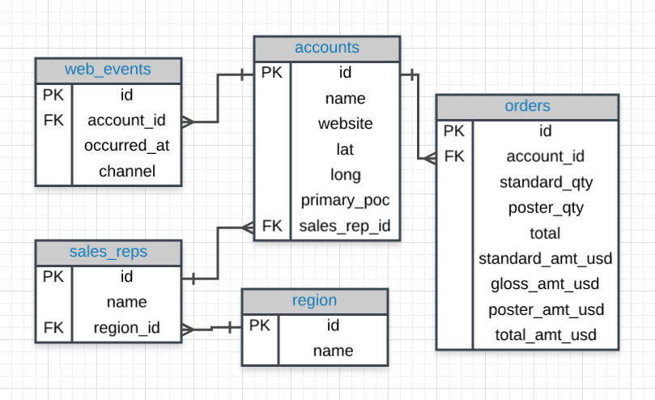
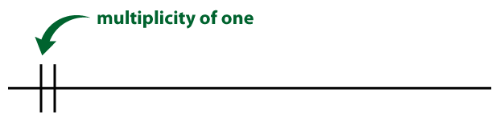
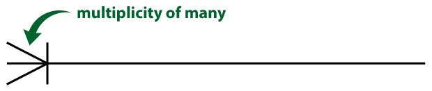
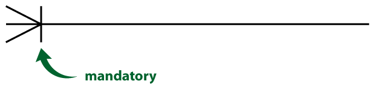
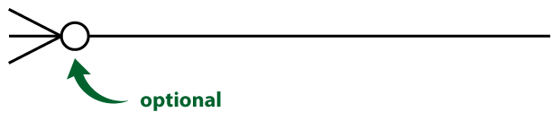
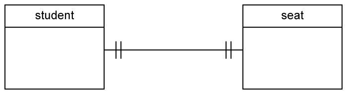
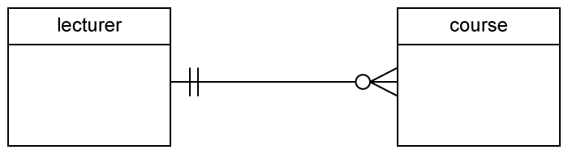
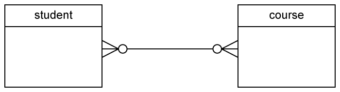

[TOC]

# SQL

## 实体关系图ERD

[来源](https://mode.com/) (parch_and_posey)



- 可以通过 ["crow's foot" 表示法](http://www.vertabelo.com/blog/technical-articles/crow-s-foot-notation)来标记出一个表格里的列与另一个表格的列之间的关联，比如 region 表格里的 `id` 对应 sales_rep 表格里 `region_id`。
  - Relationships have two indicators. These are shown on both sides of the line.

    - The first one (often called **multiplicity**) refers to the *maximum* number of times that an instance of one entity can be associated with instances in the related entity. It can be **one** or **many**.

      

      

    - The second describes the *minimum* number of times one instance can be related to others. It can be **zero** or **one**, and accordingly describes the relationship as **optional** or **mandatory**.

      

      

- One-to-one

  

- One-to-many

  

- Many-to-many

  

## 键

### 主键 (PK)

**主键**是特定表格的唯一列。在我们的每个表格中是第一列，并且这些列都叫做 **id**，但是并非必须都要这样。**通常，在大多数数据库中，主键是表格的第一列。**

### 外键 (FK)

**外键**是另一个表格中的主键。

## 数据库类型

- SQL数据库

  - 一些最受欢迎的数据库包括：:
  1. MySQL
    2. Access
    3. Oracle
    4. Microsoft SQL Server
    5. Postgres
  
  [这里](https://www.digitalocean.com/community/tutorials/sqlite-vs-mysql-vs-postgresql-a-comparison-of-relational-database-management-systems) 的文章比较了三种最常见的 SQL 类型：SQLite、PostgreSQL 和 MySQL。
  
- Non-SQL数据库

  - [MongoDB](https://classroom.udacity.com/courses/ud032)

## 数据库规范化

在创建数据库时，一定要思考下将如何存储数据。这称为**规范化**，是大多数 SQL 课程的一个重要组成部分。如果你负责设置新的数据库，则需要详细了解数据库**规范化**。

数据库规范化需要考虑以下三个要点：

1. 表格存储了逻辑分组的数据吗？
2. 我能在一个位置进行更改，而不是在多个表格中对同一信息作出更改吗？
3. 我能快速高效地访问和操纵数据吗？

[这篇文章](http://agiledata.org/essays/dataNormalization.html)详细讲解了上述内容。

## 格式

### 大写

你可能已经注意到，我们大写了 SELECT 和 FROM，而将表和列名称小写。这是一个常见的格式惯例。大写命令（SELECT、FROM），小写查询中的其他内容是常见做法。这使得查询更容易读取，这在编写更复杂的查询时更为重要。准备编写查询时，这是一个很好的习惯。

### 表和变量名中不需要空格

通常在列名中使用下划线，避免使用空格。 在 SQL 中使用空格有点麻烦。 在 Postgres 中，如果列或表名称中有空格，就需要使用双引号括住这些列/表名称（例如：FROM "Table Name"，而不是 FROM table_name）。在其他环境中，可能会使用方括号（例如：FROM [Table Name]）。

### 在查询中使用空格

SQL 查询忽略空格，因此可以根据需要在代码之间添加尽可能多的空格和空行，并且查询结果是相同的。我们来看下面这个查询

```
SELECT account_id FROM orders
```

等价于这个查询:

```
SELECT account_id
FROM orders
```

和这个查询（但是不要这样写，不符合规范，而且太丑了）:

```
SELECT              account_id

FROM               orders
```

### SQL 不区分大小写

如果你已经使用过其他语言编程，那么可能会熟悉编程语言，如果没有区分大小写键入正确的字符，那么会非常麻烦。 SQL 不区分大小写。 我们来看看下面的查询：

```
SELECT account_id
FROM orders
```

和这个相同：

```
select account_id
from orders
```

也和这个相同：

```
SeLeCt AcCoUnt_id
FrOm oRdErS
```

但是，我会再次提醒你遵循上面讲述的完全大写命令的惯例，而将其他代码片段小写。

### 分号

根据 SQL 环境，查询结尾可能需要一个执行的分号。 这个"要求"在其他环境中比较灵活。我们认为在每个语句的末尾添加一个分号是最好的做法，如果环境能够一次显示多个结果，那么这样做还可以一次运行多个命令。

最好的做法：

```
SELECT account_id
FROM orders;
```

因为，我们这里的环境不需要分号，你会看到没有分号的解决方案：

```
SELECT account_id
FROM orders
```

## 单表查询

| **语句** | **用法**                        | **其他详情**                               |
| :------- | :------------------------------ | :----------------------------------------- |
| SELECT   | SELECT **Col1**, **Col2**, ...  | 提供你想要的列                             |
| FROM     | FROM **Table**                  | 提供列存在的表                             |
| LIMIT    | LIMIT **10**                    | 限制返回的行数                             |
| ORDER BY | ORDER BY **Col**                | 根据列对表排序。与 **DESC** 一起使用。     |
| WHERE    | WHERE **Col > 5**               | 用于过滤结果的条件语句                     |
| LIKE     | WHERE **Col LIKE '%me%**        | 仅拉取文本中包含 'me' 的列                 |
| IN       | WHERE **Col IN ('Y', 'N')**     | 仅过滤包含 'Y' 或 'N' 列的行               |
| NOT      | WHERE **Col NOT IN ('Y', 'N')** | **NOT** 经常与 **LIKE** 和 **IN** 一起使用 |
| AND      | WHERE **Col1 > 5 AND Col2 < 3** | 过滤两个或多个条件必须为真的行             |
| OR       | WHERE **Col1 > 5 OR Col2 < 3**  | 过滤至少一个条件必须为真的行               |
| BETWEEN  | WHERE **Col BETWEEN 3 AND 5**   | 通常比使用 **AND** 的语法简单              |

## SQLJOIN

**JOIN** 存储的是表格，**ON** 是让**主键**等于**外键**。

### 别名

```sql
FROM tablename AS t1
JOIN tablename2 AS t2
```

- AS 可省略

### LEFTJOIN

- 国际通用，很少用RIGHT JOIN

- OUTER JOIN 罕见

- **LEFT JOIN ON**后可加**AND**替代**WHERE**语句(相当于在连接前使用WHERE语句，连接了一个只包含了AND筛选后的表)

  - 结果中包含321500和其他销售代表的数据

  ```SQL
  SELECT orders.*,
  			 accounts.*
  	FROM demo.orders
  	LEFT JOIN demo.accounts
  		ON orders.accounts_id = accounts.id
  	 AND accounts.sales_rep_id = 321500
  ```

  - 当数据库执行该查询时，它先执行连接和 **ON** 条件中的指令。将其看做构建新的结果集，然后使用 **WHERE** 条件来过滤该结果集。
  
  - 将此过滤器移到内连接的 **ON** 条件中将与使其保留在 **WHERE** 条件中产生的结果一样。
```SQL
SELECT CASE WHEN investments.investor_name IS NULL THEN 'No Investors'
            ELSE investments.investor_name END AS investor,
       COUNT(DISTINCT companies.permalink) AS companies_invested_in
  FROM tutorial.crunchbase_companies companies
  LEFT JOIN tutorial.crunchbase_investments investments
    ON companies.permalink = investments.company_permalink
 GROUP BY 1
 ORDER BY 2 DESC
```
### [UNION 和 UNION ALL](http://www.sqlservertutorial.net/sql-server-basics/sql-server-union/)

### [CROSS JOIN](http://www.sqlservertutorial.net/sql-server-basics/sql-server-cross-join/)

### [SELF JOIN](http://www.sqlservertutorial.net/sql-server-basics/sql-server-self-join/)

## SQL 聚合

### NULL

- **NULL** 是一种数据类型，表示 SQL 中没有数据
  - 与零或者空格不同，它们表示不存在数据的单元格

- 在 **WHERE** 条件中表示 **NULL** 时，我们写成 **IS NULL** 或 **IS NOT NULL**。我们不使用 `=`，因为 **NULL** 在 SQL 中不属于值。但是它是数据的一个属性。
- 在执行 **LEFT JOIN** 或 **RIGHT JOIN** 时，**NULL** 经常会发生。
- **NULL** 也可能是因为数据库中缺失数据。

***COUNT 会返回包含非空值数据行的计数***

***SUM 会忽略NULL，其他聚合函数也是这样***

***AVG 忽略 NULL，NULL不会记入分子或分母。如果想将 NULL 当做零，则需要使用 SUM 和 COUNT 。但是，如果 NULL 值真的只是代表单元格的未知值，那么这么做可能不太合适***

### GROUP BY

- **GROUP BY** 可以用来在数据子集中聚合数据，多个条件用`,`分隔
- **SELECT** 语句中的任何一列如果不在聚合函数中，则必须在 **GROUP BY** 条件中。即必须都是***折叠（collapse）***后的数据
- **GROUP BY** 始终在 **WHERE** 和 **ORDER BY** 之间。
- **ORDER BY** 有点像电子表格软件中的 **SORT**。

### DISTINCT

- **仅返回特定列的唯一值**的函数。
- 在使用 **DISTINCT** 时，尤其是在聚合函数中使用时，会让查询速度有所减慢。

### HAVING

- 对聚合结果进行筛选
  - 想对通过聚合创建的查询中的元素执行 **WHERE** 条件，就需要使用 **HAVING**。
- 位置在**GROUP BY**之后
  - **WHERE**在**GROUP BY**之前
- **HAVING** 是过滤被聚合的查询的 “整洁”方式，但是通常采用**子查询**的方式来实现

### DATE函数

- **DATE_TRUNC**

  - [PostgreSQL](https://www.postgresql.org/docs/9.1/functions-datetime.html)

  - ```SQL
    SELECT DATE_TRUNC('year', TIMESTAMP '2001-02-16 20:38:40');
    Result: 2001-01-01 00:00:00
    ```

- **DATE_PART**

  - [PostgreSQL](https://www.postgresqltutorial.com/postgresql-date_part/)

  - ```sql
    SELECT DATE_PART('dow', occurred_at) AS day_of_week,
    FROM demo.orders
    ```

### CASE

- CASE 语句始终位于 SELECT 条件中。
- CASE 必须包含以下几个部分：WHEN、THEN 和 END。ELSE 是可选组成部分，用来包含不符合上述任一 CASE 条件的情况。
- 你可以在 WHEN 和 THEN 之间使用任何条件运算符编写任何条件语句（例如 [WHERE](https://community.modeanalytics.com/sql/tutorial/sql-where/)），包括使用 AND 和 OR 连接多个条件语句。
- 你可以再次包含多个 WHEN 语句以及 ELSE 语句，以便处理任何未处理的条件。

  ```SQL
  SELECT id, account_id, CASE WHEN standard_qty = 0 OR standard_qty     IS NULL THEN 0 ELSE standard_amt_usd/standard_qty END AS unit_price
  FROM orders
  LIMIT 10;
  ```


***熟能生巧，不过太长时间都陷在某个问题上也不太合适！***

## 子查询

- 必须设置别名 
  - 跟在HAVING, WHERE后边的加括号不设置别名
- 数据库将子查询视为独立查询
- 外部查询按照外部查询的级别缩进
  - 内部查询按内部查询的级别缩进
- 如果我们返回了整个列，则需要使用 **IN** 来执行逻辑参数。如果我们要返回整个表格，则必须为该表格使用**别名**，并对整个表格执行其他逻辑。

```SQL
SELECT SUM(total_amt_usd)
FROM orders
WHERE DATE_TRUNC('month', occurred_at) =
(SELECT DATE_TRUNC('month', MIN(occurred_at)) FROM orders);
```

## WITH

- **WITH** 语句经常称为**公用表表达式**（简称 **CTE**[^CTE]）

  - [^CTE]:Common Table Expressions

- 在使用 **WITH** 创建多个表格时，需要在每个表格后面加一个逗号，但是在引向最终查询的最后一个表格后面不需添加。

- 后边的WITH语句可以使用前边WITH语句创建的临时表格

- SELECT语句中的HAVING或WHERE后加WITH语句中的表格，需要使用`SELECE * FROM xxx`

```SQL
WITH t1 AS (
SELECT r.name region_name, SUM(o.total_amt_usd) total_amt
FROM sales_reps s
JOIN accounts a
ON a.sales_rep_id = s.id
JOIN orders o
ON o.account_id = a.id
JOIN region r
ON r.id = s.region_id
GROUP BY r.name),

t2 AS (
SELECT MAX(total_amt)
FROM t1)

SELECT r.name, SUM(o.total) total_orders
FROM sales_reps s
JOIN accounts a
ON a.sales_rep_id = s.id
JOIN orders o
ON o.account_id = a.id
JOIN region r
ON r.id = s.region_id
GROUP BY r.name
HAVING SUM(o.total_amt_usd) = (SELECT * FROM t2);
```

## SQL数据清洗

### LEFT 

**LEFT(phone_number, 3)** 获取电话号码中的前三位。

**RIGHT(phone_number, 8)** 获取电话号码的最后 8 位。

### LENGTH

**LENGTH** 提供了特定列每行的字符数。

**LENGTH(phone_number)** 电话号码的长度

### UPPER()

LOWER() 转换大小写

### **POSITION** 

获取字符和列，并提供该字符在每行的索引。第一个位置的索引在 SQL 中是 1。如果你之前学习了其他编程语言，就会发现很多语言的索引是从 0 开始。

**POSITION(',' IN city_state)** 获取逗号的索引。

**STRPOS(city_state, ‘,’)** 作用与POSITION一样，参数位置交换

区分大小写

### CONCAT

拼接

- **CONCAT(first_name, ' ', last_name)**
- 或者使用双竖线：**first_name || ' ' || last_name**。

### REPLACE

> replace( 'abcdefabcdef', 'cd', 'XX')
>
> abXXefabXXef

### CAST

- TO_DATE(month, 'month')
  
- **DATE_PART('month', TO_DATE(month, 'month'))** 将月份名称改成了与该月相关的数字。
  
- **CAST(date_column AS DATE)** 将`字符串`改成`日期`
  - 在[此处](http://www.postgresqltutorial.com/postgresql-cast/)看到其他例子

  - **date_column::DATE**

### TRIM
用来删掉字符串开头和末尾的字符，这样就可以删掉一行开头或末尾的空格，从 Excel 或其他存储系统转移过来的数据经常就需要这么处理。

`trim([leading | trailing | both] [characters] from string)`

> trim(both 'x' from 'xTomxx')
>
> Tom

### SUBSTR

`substr`(`string`, `from` [, `count`])

>substr('alphabet', 3, 2)
>
>ph

### **COALESCE**

返回每行的第一个非 NULL 值

`COALESCE(descript, 'No Description')` 空值替换

在[此处](https://academy.vertabelo.com/blog/5-functions-manipulating-sql-strings/)详细了解这些函数。你还可以在[此处](https://community.modeanalytics.com/sql/tutorial/sql-string-functions-for-cleaning/)查看这节课介绍的很多函数。

### 其他

[ProgreSQL Functions](https://www.postgresql.org/docs/8.1/functions-string.html)

**LEFT**、**RIGHT** 和 **TRIM** 都仅用来选择特定的字符串元素，但是使用它们选择数字或日期元素，系统会将它们处理为字符串。

每一部分按照所学的函数设定标签，便于你复习这些数据清理功能。如果你一开始不习惯使用任何一个函数，这是正常现象，需要练习一段时间才能适应。你完全可以再看一遍这些材料，进一步磨练你的技能！

不需要记住这些功能，但是你需要学会查看文档，并从所执行的查询中学习经验，从而能够解决新的问题。

终于学完了这一部分，你很棒！

