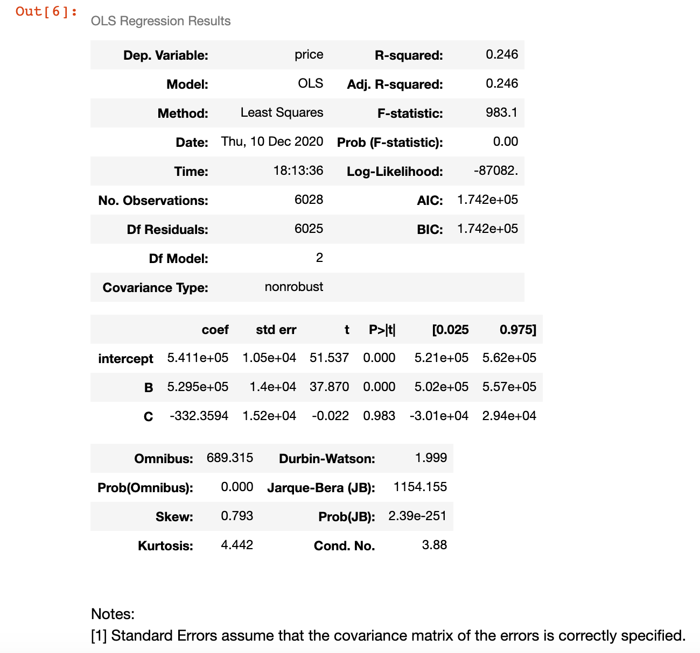
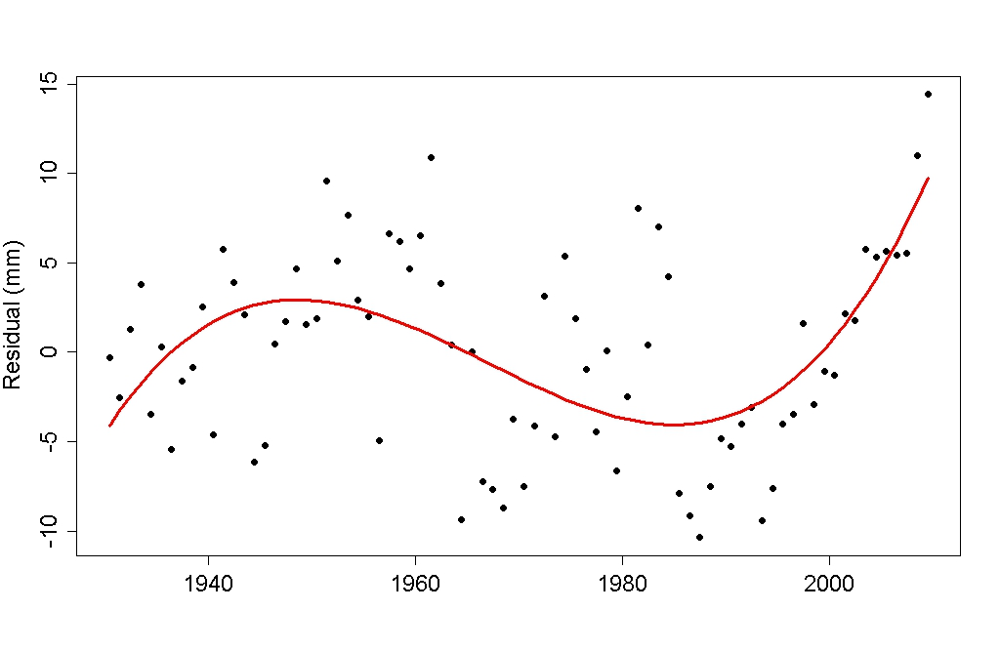
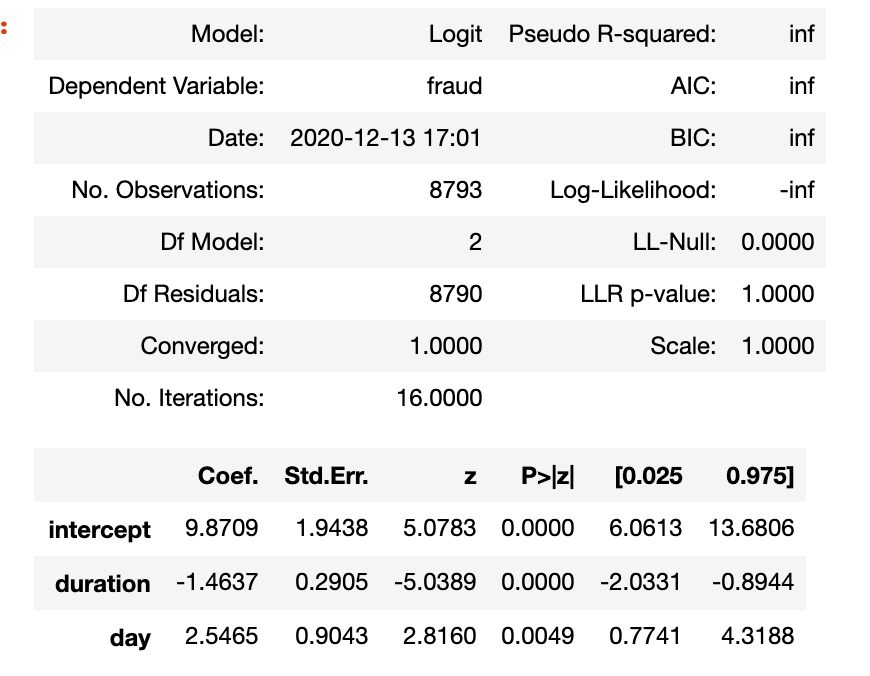

[TOC]

# 统计学

## 描述统计学

- `描述统计` **是用来描述收集的数据**，使用中心度量、散布度量、分布形态和离群值。我们也可以利用绘图数据，以便更好理解。

### 数据类型

1. 数值数据
	1. 连续值
	连续数据可以分为更小的单位，并且仍然存在更小的单位。一个例子就是狗的年龄 - 我们可以以年、月、日、小时、秒为单位测量年龄，但是仍然存在可以与年龄关联的更小单位。
	2. 离散值
	离散数据仅采用可数值。我们互动的狗的数量就是离散数据类型的一个例子。
2. 类型数据
	1. 分类定序（例如与狗的互动从很差到很好排序）
	2. 分类定类 （如狗的品种）
### 分析数值数据

- 符号

- | **表达式**                          | **中文**                                                     | **示例**         |
  | :---------------------------------- | :----------------------------------------------------------- | :--------------- |
  | X                                   | 随机变量                                                     | 网站上花费的时间 |
  | $x_1$                               | 随机变量 X 的第一个观察值                                    | 15 分钟          |
  | $\sum\limits_{i=1}^nx_i$            | 从第一个观察值到最后一个观察值的总和值                       | 5 + 2 + ... + 3  |
  | $\frac{1}{n}\sum\limits_{i=1}^nx_i$ | 从第一个观察值到最后一个观察值的总和值除以观察值的个数（均值） | (5 + 2 + 3)/3    |
  | $\bar{x}$                           | 和上面完全一样 - 数据的均值                                  | (5 + 2 + 3)/3    |

- 直方图，箱线图

- 方差标准差
  - 总体方差

  $$
  \frac1n\sum_{i=1}^n(x_i-\bar x)^2
  $$

  

  - 样本方差

  $$
  \frac1{n-1}\sum_{i=1}^n(x_i-\bar x)^2
  $$

  

#### Center 集中趋势测量

1. Mean 均值
2. Median 中位数
	- 偶数个观察值，中位数是中间两个值的平均值
3. Mode 众数
	- 如果数据集中的所有值出现的频数相同，则不存在众数

#### Spread 离散程度测量

1. 极差
2. 四分位差 (IQR)
Q3-Q1	
3. 标准差
4. 方差
5. Box-plot 箱线图 五数概括法
	- 最大值、最小值、Q1、Q2 and Q3

#### Shape 数据的形状

1. 左偏分布

   - 许多大学的成绩百分比，死亡年龄，资产价格变动

2. 右偏分布(均值大于中位数)

   - 血液中残留的药物量，呼叫中心的电话间隔时间，灯泡多久熄灭

3. 对称分布(通常是正态分布)

   - 身高、体重、误差、降雨量

  4.来源
  -  [Quora](https://www.quora.com/What-are-some-real-world-examples-of-normally-distributed-quantities)
 -  [德州大学](https://www.utdallas.edu/~scniu/OPRE-6301/documents/Important_Probability_Distributions.pdf)
  - [Stack Exchange](https://stats.stackexchange.com/questions/89179/real-life-examples-of-distributions-with-negative-skewness)
#### Outliers 异常值

**1.** 注意到它们的存在以及对概括性度量的影响。

**2.** 如果有拼写错误 —— 删除或改正。

**3.** 了解它们为什么会存在，以及对我们要回答的关于异常值的问题的影响。

**4.** 当有异常值时，报告五数概括法的值通常能比均值和标准差等度量更好地体现异常值的存在。

**5.** 报告时要小心。知道如何提出正确的问题。

 - [如何识别异常值](http://d-scholarship.pitt.edu/7948/1/Seo.pdf)

## 推论统计

`推论统计` **是利用收集的数据，对更大的总体得出结论**。使用推论统计要求我们对准确代表感兴趣的总体进行取样。

- 总体 —— 我们想要研究的整个群体。
- 参数 —— 描述总体的数值摘要
- 样本 —— 总体的子集
- 统计量 —— 描述样本的数值摘要

## 概率与数理统计
### 二项分布

$$
\begin{array}{*{20}{l}}
{\begin{array}{*{20}{l}}
{X \sim B \left( n,p \right) }\\
{P{ \left( {X=k} \right) }=C\mathop{{}}\nolimits_{{n}}^{{k}}p\mathop{{}}\nolimits^{{k}} \left( 1-p \left) \mathop{{}}\nolimits^{{n-k}}\text{（}k=0,1,2, \cdots ,n\text{）}\right. \right. }
\end{array}}\\
{EX=np}\\
{DX=np \left( 1-p \right) }
\end{array}
$$


### 条件概率

$$
\begin{array}{*{20}{l}}
{\text{定}\text{义}\text{在}\text{事}\text{件} B\text{已}\text{经}\text{发}\text{生}\text{情}\text{况}\text{下}\text{，}}\\
{\text{事}\text{件}A\text{发}\text{生}\text{的}\text{条}\text{件}\text{概}\text{率}\text{为}}\\
{P{ \left( {A \left| B\right. } \right) }=\frac{{P{ \left( {A\cap B} \right) }}}{{P{ \left( {B} \right) }}}}\\
{\text{其}\text{中}P{ \left( {B} \right) } > 0}
\end{array}
$$

- P(A) 表示 "A 的概率"
  P(¬A) 表示 "非 A 的概率"
  P(A,B)表示 "A 和 B 同时发生的 概率" 并且
  P(A∣B) 表示 "条件为 B 时 A 发生的概率"。


- 全概率公式

  $$
  \begin{array}{*{20}{l}}
  {\text{若}\text{有}\mathop{ \bigcup }\limits_{{k=1}}^{{n}}\mathop{{B}}\nolimits_{{k}}=S}\\
  {\text{且}\text{有}\mathop{{B}}\nolimits_{{i}}\mathop{{B}}\nolimits_{{j}}= \emptyset { \left( {i \neq j,i,j=1,2,3, \cdots n} \right) }}\\
  {\text{且}\text{有}P{ \left( {\mathop{{B}}\nolimits_{{k}}} \right) } > 0{ \left( {k=1,2,3, \cdots n} \right) }}\\
  {\text{则}\text{有}P{ \left( {A} \right) }=\mathop{ \sum }\limits_{{k=1}}^{{n}}P{ \left( {\mathop{{B}}\nolimits_{{k}}} \right) } \cdot P{ \left( {A \left| \mathop{{B}}\nolimits_{{k}}\right. } \right) }}
  \end{array}
  $$
  

### 贝叶斯法则

- 先验概率 / Prior

  > 进行化验之前的概率，如癌症患病概率0.01

- 敏感度 / Sensitivity

  > 如患病情况下检验结果为阳性的概率0.9

- 特异度 / Specificity

  > 如没患病情况下检验结果为阳性的概率0.2

- 联合概率

  > 化验结果为阳性**且**患病的概率 P( C, Pos )

- 后验概率 / Posterior

  > 如化验结果阳性时患病的概率 P( C|Pos )

- 简单写法

$$
P(A|B)=\frac {P(B|A) \cdot P(A)} {P(B)}
$$

- 完整写法

$$
\begin{array}{*{20}{l}}
{\text{若}\text{有}\mathop{ \bigcup }\limits_{{k=1}}^{{n}}\mathop{{B}}\nolimits_{{k}}=S}\\
{\text{且}\text{有}\mathop{{B}}\nolimits_{{i}}\mathop{{B}}\nolimits_{{j}}= \emptyset { \left( {i \neq j,i,j=1,2,3, \cdots n} \right) }}\\
{\text{且}\text{有}P{ \left( {\mathop{{B}}\nolimits_{{k}}} \right) } > 0{ \left( {k=1,2,3, \cdots n} \right) }}\\
{\text{且}\text{有}P{ \left( {A} \right) } > 0}\\
{\text{则}\text{有}P{ \left( {\mathop{{B}}\nolimits_{{k}} \left| A\right. } \right) }=\frac{{P \left( {\mathop{{B}}\nolimits_{{k}}} \left)  \cdot P{ \left( {A \left| {\mathop{{B}}\nolimits_{{k}}}\right. } \right) }\right. \right. }}{{\mathop{ \sum }\limits_{{i=1}}^{{n}}P{ \left( {\mathop{{B}}\nolimits_{{i}}} \right) } \cdot P{ \left( {A \left| \mathop{{B}}\nolimits_{{i}}\right. } \right) }}}}
\end{array}
$$

 

### 正态分布

$$
\mathcal{N}(x,\mu, \sigma^2)=\frac{1}{\sqrt{{2\pi\sigma^2}}}e^{\frac{1}{2}(\frac{x-\mu}{\sigma})^2}
$$

- 符号

|    **参数**     |      **统计量**       | **描述**                                 |
| :-------------: | :-------------------: | :--------------------------------------- |
|      $\mu$      |       $\bar{x}$       | "数据集的平均值"                         |
|      $\pi$      |          $p$          | "仅包括数值 0 和 1 的数据集平均数：比例" |
| $\mu_1 - \mu_2$ | $\bar{x}_1-\bar{x}_2$ | "平均数差异"                             |
| $\pi_1 - \pi_2$ |       $p_1-p_2$       | "比例差异"                               |
|     $\beta$     |          $b$          | "回归系数：通常出现在下标"               |
|    $\sigma$     |          $s$          | "标准差"                                 |
|   $\sigma^2$    |         $s^2$         | "方差"                                   |
|     $\rho$      |          $r$          | "相关系数"                               |

### 大数定律

- **随着样本容量增加，样本平均数越来越接近总体平均数**

- 参数估计方法
  - [最大似然估计 ](https://zh.wikipedia.org/wiki/%E6%9C%80%E5%A4%A7%E4%BC%BC%E7%84%B6%E4%BC%B0%E8%AE%A1)
  - [矩估计](https://zh.wikipedia.org/wiki/%E7%9F%A9%E4%BC%B0%E8%AE%A1)
  - [贝叶斯估计](https://en.wikipedia.org/wiki/Bayes_estimator)

### 中心极限定理

- **样本容量足够大，平均数的抽样分布越接近正态分布**
  - 适用于
    - 样本平均数 ($\bar{x}$)
    - 样本比例 ($p$)
    - 样本平均数的差异 ($\bar{x}_1 - \bar{x}_2$)
    - 样本比例的差异 ($p_1 - p_2$)
  - 不适用于
    - 方差 $S^2$
    - 相关系数 $r$
    - 最大值$x_{(n)}$

### 自助法 bootstrap 放回抽样

- 直接对抽样分布进行模拟，**不再考虑定理**
- 通过创建自助法，利用抽样分布，仅从一个样本中很好地发现一个参数
- `Random.choice`

- [布拉德利·埃弗龙 (Bradley Efron) ](https://en.wikipedia.org/wiki/Bradley_Efron)
- [自助法可以作为推论技巧的原因](https://stats.stackexchange.com/questions/26088/explaining-to-laypeople-why-bootstrapping-works)

### 置信区间

- 使用置信区间和假设检验，你能够在做决策时提供 **统计显著性**。

  然而，做决策时考虑 **实际显著性** 同样很重要。 **实际显著性** 考虑到所处情况的其他因素，假设检验或置信空间的结果可能不会直接考虑到这种情况。**空间**、**时间** 或 **金钱** 等约束条件对商业决定很重要。但是可能不会在统计测试中直接考虑这些因素。

- 增加样本容量，会降低置信区间的宽度。

- 增加置信度 (如 95% 增加到 99%) 会增加置信区间的宽度。

[传统方法](https://stattrek.com/hypothesis-test/hypothesis-testing.aspx)

#### 用自助法创立置信区间

##### 均值

  ```Python
  import pandas as pd
  import numpy as np
  import matplotlib.pyplot as plt
  
  coffee_full = pd.read_csv('coffee-dataset.cav') #总体
  coffee_red = coffee_full.sample(200) #样本
  
  bootsample = coffee_red.sample(200, replace = True) #从样本中自助法抽样
  bootsample[bootsample['drink_coffee'] == True]['height'].mean() #获取一次自助抽样样本的均值
  ```

  ```Python
  #获得自助抽样均值的列表
  boot_means = []
  for _ in range(10000):
    bootsample = coffee_red.sample(200, replace = True)
    boot_means.append(bootsample[bootsample['drink_coffee'] == True]['height'].mean())
  ```

  `plt.hist(boot_means);`

  ```Python
  #得到95%置信区间
  np.percentile(boot_means, 2.5), np.percentile(boot_mean, 97.5)
  ```

  ```Python
  #计算总体均值, 看有没有落在使用自助法得到的置信区间内
  coffee_full[coffee_full['drink_coffee'] == True]['height'].mean()
  ```

##### 均数差

```Python
import pandas as pd
import numpy as np
import matplotlib.pyplot as plt
%matplotlib inline

coffee_full = pd.read_csv('coffee-dataset.csv')
coffee_red = coffee_full.sample(200)
```

```Python
diff = []
for _ in range(10000):
  bootsample = coffee_red.sample(200, replace = True)
  mean_coff = bootsample[bootsample['drinks_coffee'] == True]['height'].mean()
	mean_nocoff = bootsample[bootsample['drinks_coffee'] == False]['height'].mean()
  diff.append(mean_coff - mean_nocoff)
```

```Python 
plt.hist(diff);
```

```Python
np.percentile(diffs,2.5), np.percentile(diffs,97.5) # 得到95%置信区间
```

```Python
plt.hist(diff);
plt.axvline(x=low, color='r', linewidth=2);# 画出下界
plt.axvline(x=high, color='r', linewidth=2);# 画出上界
```


### 假设检验

1. 在收集数据前，$H_0$ 为真。
2. $H_0$ 通常表示没有影响或对两组影响相同。
3. $H_0$ 和 $H_1$ 是竞争性、非重叠的假设。
4. $H_1$ 可以证明为真。
5. $H_0$包含一个等号：$=$ 、$\leq$ 或 $\geq$。
6. $H_1$ 包含非空值：$\neq$、$>$ 或 $<$。

例如表述 "证明有罪之前是无辜的" 表明下列假设为真：

$H_0$: 无辜的

$H_1$: 有罪的

我们可以认为在收集数据之前，"无辜的" 为真。然后备择假设必须是竞争性、非重叠的假设。因此备择假设为一个人有罪。

#### 零假设和备择假设

- 新旧网页A/B Test

$H_0:\mu_{new} \leq \mu_{old}$

$H_1:\mu_{new} > \mu_{old}$

- 我们希望新网页比较好，但是我们需要证明它，所以新网页比较好是备择假设
- 零假设含有等号，备择假设为大于号、小于号或者不等号

#### 一类错误与二类错误

##### **I 类错误** 

1. ***你应该设置零假设和备择假设，I 类错误是更严重的错误。***
2. 它们由 $\alpha$ 符号表示。
3. I 类错误的定义是： **($$H_0$$) 为真时，认为备择假设 ($H_1$) 为真。**
4. I 类错误通常称为 **误报**。假阳性

##### **II 类错误**

1. 它们由 $\beta$ 符号表示。
2. II 类错误的定义是：**($H_1$) 为真时，认为零假设 ($H_0$) 为真。**
3. II 类错误通常称为 **漏报**。

#### 常见假设检验

通常针对 **总体参数** 进行假设测验，而不是针对统计量。统计量是已经从数据中得到的，因此不需要假设测试验证这些数值。

常见的假设检验包括：

1. 测试总体平均数 [(单样本 t 检验)](https://www.cliffsnotes.com/study-guides/statistics/univariate-inferential-tests/one-sample-t-test)。
2. 测试均数差 [(双样本 t 检验)](http://www.itl.nist.gov/div898/handbook/eda/section3/eda353.htm)
3. 测试个体治疗前后的差异 [(配对 t 检验)](http://www.statstutor.ac.uk/resources/uploaded/paired-t-test.pdf)
4. 测试总体比例 [(单样本 z 检验)](https://stattrek.com/statistics/dictionary.aspx?definition=one-sample z-test)
5. 测试总体比例的差异 [(双样本 z 检验)](https://onlinecourses.science.psu.edu/stat414/node/268)

**这有几百个不同的假设检验！** 不过，你不是记忆如何完成所有这些检验，而是找到最佳估算参数的统计量，然后使用自助法模拟抽样分布。然后你可以利用抽样分布，帮助选择合适的假设检验。

#### 用自助法假设检验

1. 
   1. 自助法构建置信区间
   2. 比较零假设区间或备择假设空间与构建的置信区间的关系，选择认为正确的假设

2.  

   1. 模拟零假设中得出统计量的数值。
   2. 计算你实际从数据中得到统计量的数值。
   3. 对比统计量和零假设中的数值。
   4. 根据备择假设，计算 被视为**极端** 空值的比例。

   ```Python
   sample_df = df.sample(150)
   
   means = []
   for _ in range(10000):
   	bootsample = sample(200, replace = True)
     means.append(bootsample.height.mean())
   ```

   ```Python
   np.std(means)
   ```

   ```Python
   null_vals = np.random.normal(70, np.std(means), 10000)
   # numpy.random.normal(loc=0.0, scale=1.0, size=None)
   
   #loc:mean, scale:std, size:输出的shape，可以理解为模拟的次数
   ```

   ```Python
   plt.hist(null_vals);
   ```

   `sample_mean = sample_df.height.mean()`远低于零假设构造出的正态分布的均值

   `(null_vals > sample_mean).mean()` 备择假设为$\mu >70$时计算$p$值（大于样本均值的模拟样本的比例）

#### $p$值

- 零假设为真的情况下，~~假设构造的统计数据中~~观察到支持备择假设的数据(更极端内容)的概率
- 如果 $p$ 值小于 I 类错误阈值，你可以拒绝零假设，选择备择假设。否则，不拒绝零假设。
  - $p$值较大不应该抛弃零假设
  - $pval\leq\alpha \Rightarrow拒绝H_0$
  - $pval>\alpha \Rightarrow不拒绝H_0$
- 结论中“拒绝零假设” or “不拒绝零假设”

#### 其他要考虑的事情

1. 样本能否代表总体
2. 样本量的影响
   - 大样本量不适用于假设检验
     - 机器学习效果更好
3. 校正
   - **邦弗朗尼** 校正法
   - [图基校正](http://www.itl.nist.gov/div898/handbook/prc/section4/prc471.htm)
   - [Q 值](http://www.nonlinear.com/support/progenesis/comet/faq/v2.0/pq-values.aspx)

## 回归

### 相关系数

相关系数是 **线性** 关系 **相关程度** 和 **相关方向** 的一种衡量方式。

我们可以根据相关性是正还是负来判断相关方向。

- 判断相关程度的小窍门：

  |    **强**     |   **中度**    |    **弱**     |
  | :-----------: | :-----------: | :-----------: |
  | 0.7≤∣*r*∣≤1.0 | 0.3≤∣*r*∣<0.7 | 0.0≤∣*r*∣<0.3 |

- 相关系数的计算

$$
r = \frac{\sum\limits_{i=1}^n(x_i - \bar{x})(y_i - \bar{y})}{\sqrt{\sum(x_i - \bar{x})^2}\sqrt{\sum(y_i - \bar{y})^2}}
$$

你还能用 Excel 等电子表格程序来计算相关系数，在电子表格程序里，使用函数 **CORREL(col1, col2)** 方可计算，其中 **col1** 和 **col2** 为你想进行比较的两列。

- 回归线通常由 **截距** 和 **斜率** 决定。

  **截距** 的定义为 **当 x 变量为 0 时，反应变量的预测值**。

  **斜率** 的定义为 **x 变量每增加一个单位引起的反应变量的预测变化**。

  我们将线性回归的回归线记为：

  $\hat{y} = b_0 + b_1x_1$

  其中

  $\hat{y}$ 为回归线反应变量的预测值。

  $b_0$ 为截距。

  $b_1$ 为斜率。

  $x_1$ 为解释变量。

  $y$ 为数据集某个数据点的实际反应变量值 (不是回归线的预测值)。

- 要找出最佳回归线，我们用的主要算法叫做 **最小二乘法**，使用该算法，我们可找出一条最小化 $\sum\limits_{i=1}^n(y_i - \hat{y_i})$的回归线。
  - 为了得到斜率和截距，我们需要进行如下计算：

    $\bar{x} = \frac{1}{n}\sum x_i$

    $\bar{y} = \frac{1}{n}\sum y_i$

    $s_y = \sqrt{\frac{1}{n-1}\sum\limits(y_i - \bar{y})^2}$

    $s_x = \sqrt{\frac{1}{n-1}\sum\limits(x_i - \bar{x})^2}$

    $r = \frac{\sum\limits_{i=1}^n(x_i - \bar{x})(y_i - \bar{y})}{\sqrt{\sum(x_i - \bar{x})^2}\sqrt{\sum(y_i - \bar{y})^2}}$

    $b_1 = r\frac{s_y}{s_x}$

    $b_0 =\bar{y} - b_1\bar{x}$

### [[Python回归]]

  ```Python
  # pip install statsmodels
  import statsmodels.api as sm
  df = pd.readcsv('xxx.csv')
  df['intercept'] = 1 # 添加截距列(statsmodels不会自动添加)
  lm = sm.OLS(df['y'], df[['intercept', x_1, x_2, ...]])
  results = lm.fit()
  results.summary()
  ```

  [这里](https://stats.stackexchange.com/questions/7948/when-is-it-ok-to-remove-the-intercept-in-a-linear-regression-model) 是一个帖子，里面谈到几乎所有回归都需要截距。重申一次，只有极少数情况不需要在线性模型里使用截距。

  - 我们可以用 Python (或其它软件) 来对线性模型的系数进行假设检验。这些测试能帮我们判断某个变量与其反应变量是否具有具统计显著性的线性关系，不过对截距进行假设检验通常没什么作用。
  
    然而，对每个 x 变量进行假设检验，测试所涉及的两组为：总体斜率等于 0 vs. 参数不等于 0 的其它情况（对立假设）。因此，如果斜率不等于 0 (即对立假设为真)，那我们就能证明与那个系数有关的 x 变量与反应变量间有具统计显著性的线性关系，也就意味着 x 变量能帮我们预测反应变量 (或者，最起码意味着模型里有 x 变量比没有好)。
  
  - **决定系数** 即相关系数的平方。
  
    决定系数变量通常定义为模型中能以 x 变量解释的反应变量的变化范围。通常来说，决定系数越接近 1，模型就越拟合数据。
  
    很多人觉得决定系数不是个很好的衡量标准 (他们可能是对的)，不过我想说，我们所使用的任何衡量模型数据拟合度的方法，都可借助交叉验证来判断其准确性。[这里](http://data.library.virginia.edu/is-r-squared-useless/) 是一位朋友的文章，里面就用交叉验证探讨了他觉得决定系数不好的原因。
  
  - 编码[[虚拟变量]]
  
    - 把分类变量转变为 **虚拟变量**。
    
    - 转化后，你需要舍弃一个 **虚拟列**，才能得到 [满秩](https://www.cds.caltech.edu/~murray/amwiki/index.php/FAQ:_What_does_it_mean_for_a_non-square_matrix_to_be_full_rank%3F) 矩阵。
    
      - 回归系数闭式解，得用 $(X'X)^-X'y$来预测 $\beta$值。
    
        为了逆转 $(X'X)$，矩阵 $X$ 一定要是满秩的，也就是说，所有 $X$ 的列都必须线性独立。
    
    - ```Python
      df[['A', 'B', 'C']] = pd.get_dummies(df[分类变量]) # 0, 1编码
      ```
    
      - 一定要舍弃一列，该列称为“基准类别”
      
    - ```Python
      ## The below function creates 1, 0, -1 coded dummy variables.
      
      def dummy_cat(df, col):
          '''
          INPUT:
          df - the dataframe where col is stored
          col - the categorical column you want to dummy (as a string)
          OUTPUT:
          df - the dataframe with the added columns
               for dummy variables using 1, 0, -1 coding
          '''
          for idx, val_0 in enumerate(df[col].unique()):
              if idx + 1 < df[col].nunique():            
                  df[val_0] = df[col].apply(lambda x: 1 if x == val_0 else 0)
              else:    
                  df[val_0] = df[col].apply(lambda x: -1 if x == val_0 else 0)
                  for idx, val_1 in enumerate(df[col].unique()):
                      if idx + 1 < df[col].nunique():
                          df[val_1] = df[val_0] + df[val_1]
                      else:
                          del df[val_1]
          return df
      ```
    
      ```Python
      new_df = dummy_cat(df, 'style') # Use on style
      ```
    
      - 基准改为平均值
  
- 多元线性回归结果解释

  

  - coef 系数，自变量每增加一个单位因变量增加的单位数
  - P值可以提供是否认为一个变量对响应具有统计相关性的背景
  - $R^2*100$%的因变量变动可由自变量创建的线性模型解释

### 模型假设及相应的解决方法

[统计学习简介](http://faculty.marshall.usc.edu/gareth-james/ISL/ISLR%20Seventh%20Printing.pdf)其中提到了如下五个假设：

1. 因变量-自变量关系的非线性
2. 误差项的相关性
3. 非恒定方差和正态分布误差
4. 异常值/高杠杆点
5. 共线性

本文总结了判断上述问题是否存在的方法以及相应的解决办法。这是统计学家面试时经常提出的问题，但该问题是否有实际意义取决于你创建模型的目的。在接下来的概念中，我们会更仔细地研究某些相关知识点，因为我觉得我们需要额外注意那些，但下方为你列出了各知识点的详尽介绍，我们先来仔细看看下文涉及的每一项。

#### 线性

线性是假设因变量和自变量之间真的存在可用线性模型解释的关系。如果线性假设不为真，那你的预测结果就不会很准确，此外，与系数有关的线性关系也就没什么用了。

为了评估某段线性关系是否合理，一个很实用的方法是做预测值 ($\hat{y}$) 的残差 ($y - \hat{y}$)图。如果图中出现多个曲线部分，那就意味着线性模型实际上可能并不拟合数据，自变量和因变量存在其它关系。创建非线性模型的办法有很多（甚至可以线性模型的形式来创建），其中几种办法会在本课后面的内容中提及。

在下列图片里，这些称为 **偏差** 模型。理想来说，我们想要的是像图片左上角残差图那样的随机散点图。


#### 相关误差

如果我们是随时间变化来收集的数据（比如预测未来股价或利率），或数据与空间有关（如预测洪涝或干旱地区），那就很容易出现相关误差。通常，我们可以用过去数据点提供的信息（针对与时间有关的数据）或用相邻数据点提供的信息（针对与空间有关的数据）来提高预测结果。

不考虑相关误差的主要问题在于：往往你会利用这一相关性，得到更好的未来事件预测数据或空间关联事件预测数据。

要判断是否有相关误差，最常用的方法是观察收集数据的域。要是你不确定的话，你可以试试一个叫 [Durbin-Watson](https://en.wikipedia.org/wiki/Durbin–Watson_statistic) 的检验方法，人们常用该测试来评估误差相关性是否造成问题。还有 [ARIMA 或 ARMA](http://www.statsref.com/HTML/index.html?arima.html) 模型，人们常用这两个模型来利用误差相关性，以便做出更佳预测。

#### 非恒定方差和正态分布误差

你预测的值不同，得到的预测值范围也不同，那就意味着方差不恒定。非恒定方差对预测好坏影响不大，但会导致置信区间和 p 值不准确，这种时候，在预测值接近实际值的那部分区域，系数的置信区间会太泛，而在预测值较远离实际值的区域则会太窄。

通常来说，对数函数（或使用其它反应变量的变换方式）能够 “摆脱” 非恒定方差，而要选择合适的变换方式，我们一般会用 [Box-Cox](http://www.statisticshowto.com/box-cox-transformation/)。

用预测值的残差图也可以评估非恒定方差。在本页底部的图片中，非恒定方差的标签为 **异方差**。理想来说，我们要的是一个有异方差残差的无偏模型（其异方差残差在一定数值范围内保持不变）。

虽然本文并不探讨残差的正态性，如果你想创建可靠的置信区间，正态性回归假设就十分重要了，更多相关信息详见 [这里](http://www.itl.nist.gov/div898/handbook/pri/section2/pri24.htm)。

#### 异常值/杠杆点

异常值和杠杆点是远离数据正常趋势的点。这些点会对你的解造成很大的影响，在现实中，这些点甚至可能是错误的。如果从不同来源收集数据，你就可能在记录或收集过程中造成某些数据值出错。

异常值也可能是准确真实的数据点，而不一定是测量或数据输入错误。在这种情况下，'修复'就会变得更为主观。要如何处理这些异常值往往取决于你的分析目的。线性模型，特别是使用最小二乘法的线性模型，比较容易受到影响，也就是说，大异常值可能会大幅度地左右我们的结果。当然，异常值也有一些解决技巧，也就是我们常说的 **正则化**。本课不会谈及这些技巧，但在 [机器学习纳米学位免费课程](https://classroom.udacity.com/courses/ud120)中，我们对这些技巧做了粗略的介绍。

而在宾夕法尼亚州立大学提供的完整回归课程里，就有特别长的篇幅在探讨杠杆点的问题，详见 [这里](https://onlinecourses.science.psu.edu/stat501/node/336)。

#### 共线性（多重共线性）

如果我们的自变量彼此相关，就会出现多重共线性。多重共线性的一个主要问题在于：它会导致简单线性回归系数偏离我们想要的方向。

要判断是否有多重共线性，最常见的办法是借助二变量图或 **方差膨胀因子 (即 VIFs)**。下一概念我们就要更深入地探讨多重共线性，因而在此不做赘述。

1. 散点图矩阵

   > seaborn.pairplot(df['A', 'B', 'C'])

2. 方差膨胀因子VIF
   $$
   V.I.F._i=\frac 1 {1-R_i^2}
   $$
   $R^2$通过所有其他X变量预测出的X变量$R^2$计算得到

   > 如果VIF > 10, 表明模型出现多重共线性

   - 解决办法：删除最小兴趣的变量，重新计算VIF令所有VIF<10, 如果决定系数$R^2$变化不大(如两个数位保持不变)，则意味着删除很合理

   ```Python
   from patsy import dmatrices
   from statsmodels.stats.outliers_influence import variance_inflation_factor
   import statsmodels.api as sm
   y, X = dmatrices('price ~ area + bathroom', df, return_type='dataframe')
   vif = pd.DataFrame()
   vif["features"] = X.columns
   vif["VIF Factor"] = [variance_inflation_factor(X.values, i) for i in range(X.shape[1])]
   vif.round(1)
   ```
   
     - [VIFs](https://etav.github.io/python/vif_factor_python.html) 相关网站以供参考。

### 非线性相关-高阶项(Higher Order Terms)

- $x_1x_2$, $x^2$, $x^3$, $x^4$等等

- 一般不用，除非数据中明确观察到存在关系

- 增加高阶项会使解释数据的结果更加复杂

#### 要怎么确定高阶项？

在创建具备 **二阶**、**三阶** 甚至更高阶变量的模型时，基本上我们要看的是解释变量和反应变量的关系里有多少条曲线。

如果像下图一样，图中曲线折了一个弯，那你会想添加一个二阶项到模型里，因为我们可以明显地发现，只用一条线来拟合这个关系并不能得到最佳效果。


当解释变量和反应变量的关系折了两个弯，我们就会想添加一个三阶的关系，如下图所示。




https://tamino.wordpress.com/2011/03/31/so-what/

### 模型拟合

- 测量标准
  - $R^2$
  - MSE(均方差)
  - AIC(赤池信息准则)
  - BIC(贝叶斯信息准则)
  - Mallow's CP
  - ...

### K折交叉验证

- 见MachineLearning.md

## 逻辑回归

- 正确预测两个可能结果中的一个
  
  - 预测范围在0和1之间的概率
- 优势率 Odds
  - $\frac p {1-p}$
  - p是某个事件发生的概率，Odds表示某个事件发生相比于事件不会发生的概率
- sigmoid
  
  - 通过线性回归得到概率值并且控制在[0, 1]
- [[Python逻辑回归]]

  ```Python
  import statsmodels.api as sm
  df[['no_fraud', 'fraud']] = pd.get_dummies(df['fraud'])
  df['intercept'] = 1

  logit_mod = sm.Logit(df['fraud'], df[['intercept', 'duration']])
  results = logit_mod.fit()
  results.summary2() 
  ```
  
  - 
  
    - p值表示是否具有统计显著性
  
    - 系数为指数化系数
  
      - 对每个系数求幂
  
      - np.exp(-1.4637), np.exp(2.5465)
  
        > (0.231, 12.762)
  
    - 分别表示
  
      - 交易时常每增加1分钟诈骗概率增加0.23倍
  
        - 对其求倒数`1/np.exp(-1.4637)`
  
          - > 4.32
  
        - 表示交易时常每减少1分钟诈骗概率增加4.32倍
  
      - 工作日诈骗概率是周末12.762倍

