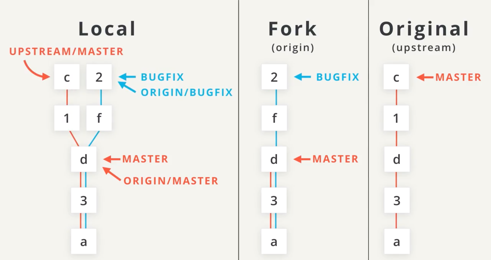

[TOC]
# [[Git]]

## 三个区域

- 工作区 / Working Directory

- 暂存区 / Staging Index

- 仓库区 / Repository

:bulb: ​

1. 文件最开始在工作区
2.  使用shell命令**移动**到暂存区
3. 最后**提交**到仓库区


:warning: commit只能提交暂存区的内容

## 安装和配置

1. [下载地址](https://git-scm.com/downloads)

2. 配置终端（可选）

   1. `ls-a`查看主目录是否已经有`.bash_profile`

   2. `atom .bash_profile`打开文件进行编辑

      ```bash
      # Enable tab completion
      source ~/.udacity-terminal-config/git-completion.bash
      
      # Change command prompt
      source ~/.udacity-terminal-config/git-prompt.sh
      
      # colors!
      red="\[\033[38;5;203m\]"
      green="\[\033[38;05;38m\]"
      blue="\[\033[0;34m\]"
      reset="\[\033[0m\]"
      
      export GIT_PS1_SHOWDIRTYSTATE=1
      
      # '\u' adds the name of the current user to the prompt
      # '\$(__git_ps1)' adds git-related stuff
      # '\W' adds the name of the current directory
      export PS1="$red\u$green\$(__git_ps1)$blue \W
      $ $reset"
      ```

3. 配置Git

      1. 设置你的 Git 用户名`git config --global user.name "<Your-Full-Name>"`
      2. 设置你的 Git 邮箱`git config --global user.email "<your-email-address>"`
      3. 确保 Git 输出内容带有颜色标记`git config --global color.ui auto`
      4. 对比显示原始状态`git config --global color.ui autogit config --list`
      5. `git config --list`

4. 配置代码编辑器

      1. Atom Editor 设置

         > ```bash
         > git config --global core.editor "atom --wait"
         > ```

      2. Sublime Text 设置

         > ```bash
         > git config --global core.editor "'/Applications/Sublime Text 2.app/Contents/SharedSupport/bin/subl' -n -w"
         > ```

      3. VSCode 设置

         > ```bash
         > git config --global core.editor "code --wait"
         > ```


[Git 基础 - 获取 Git 仓库 - 英](https://git-scm.com/book/en/v2/Git-Basics-Getting-a-Git-Repository#Initializing-a-Repository-in-an-Existing-Directory) | [中](https://git-scm.com/book/zh/v2/Git-基础-获取-Git-仓库)

## Git 命令

### **.gitignore**

创建一个文件.gitignore，将此文件添加到**项目根目录**。希望 git ignore（忽略，不跟踪）的文件名添加到.gitignore中，git 将忽略这些文件。可使用[通配符](/Users/season/Google Drive/Udacity_2.0/笔记/通配符.md)

### git init

- init 子命令是"initialize"（初始化）的简称，这个命令很有用，因为它将进行所有仓库初始设置。

- 在当前目录下创建新的空仓库。

- 运行此命令可以创建隐藏 `.git` 目录。此 `.git` 目录是仓库的核心/存储中心。它存储了所有的配置文件和目录，以及所有的 commit。

  :bulb: 下面简要概述了 `.git` 目录下的各项内容：

    - **config 文件** - 存储了所有与项目有关的配置设置。

        摘自于 [Git Book - 英](https://git-scm.com/book/en/v2/Customizing-Git-Git-Configuration) | [中文点此处](https://git-scm.com/book/zh/v2/自定义-Git-配置-Git)：

        > Git 会查看 Git 目录下你当前所使用仓库对应的配置文件（.git/config）中的配置值。这些值仅适用于当前仓库。

        例如，假设你将 Git 全局配置为使用你的个人电子邮箱。如果你想针对某个项目使用你的工作邮箱，则此项更改会被添加到该文件中。

    - **description 文件** - 此文件仅用于 GitWeb 程序，因此可以忽略

    - **hooks 目录** - 我们会在此处放置客户端或服务器端脚本，以便用来连接到 Git 的不同生命周期事件

    - **info 目录** - 包含全局排除文件

    - **objects 目录** - 此目录将存储我们提交的所有 commit

    - **refs 目录** - 此目录存储了指向 commit 的指针（通常是“分支”和“标签”）

        注意，除了 hooks 目录，你应该不会对这里的其他内容有太多的困扰。hooks 目录可以用来连接到 Git 工作流的不同部分或事件，但是在这门课程中，我们不会对此作过多介绍。
  
- `rm -rf .git` 删除.git文件可将当前目录下的git仓库删除，不会影响子文件夹下的git仓库

- 深入研究
  - Git 内部原理 - 底层命令和高层命令 : [英](https://git-scm.com/book/en/v2/Git-Internals-Plumbing-and-Porcelain) | [中](https://git-scm.com/book/zh/v2/Git-内部原理-底层命令和高层命令)（进阶内容——请将此网址添加到书签中，并在以后查看）
  - [自定义 Git - Git Hooks - 英](https://git-scm.com/book/en/v2/Customizing-Git-Git-Hooks) | [中](https://git-scm.com/book/zh/v2/自定义-Git-Git-钩子)

### git clone

```bash
git clone https://github.com/udacity/course-git-blog-project
```

- `git clone` 命令被用于将项目仓库复制到当前目录
- `git clone <path-to-repository-to-clone> new_name` 将项目**重命名**为 new_name

### git status

- 支持中文

  ```bash
  git config --global core.quotepath false
  ```

- 告诉我们已在工作目录中被创建但 Git 尚未开始跟踪的新文件

- Git 正在跟踪的已修改文件

- 显示技巧

  - `git status | less`
  - 要向下滚动，按下
    - j 或 ↓ 一次向下移动一行
    - d 按照一半的屏幕幅面移动
    - f 按照整个屏幕幅面移动
  - 要 向上滚动，按上
    - k 或 ↑ 一次向上移动一行
    - u 按照一半的屏幕幅面移动
    - b 按照整个屏幕幅面移动
  - 按下 q 可以退出日志（返回普通的命令提示符）

### git add 

- **将文件上传到暂存区**
- git rm --cached <file>，删除**暂存区**文件，不会破坏**工作区**文件。

- 可接受多个文件名（用**空格**分隔）
-  `git add . `来代替文件列表，告诉 git 添加当前目录至暂存区（以及所有嵌套文件）

### git commit 

- `git commit -m "Initial commit"` 当信息很短不想打开Atom编辑提交信息时使用`-m`
- [Commit message 和 Change log 编写指南](http://www.ruanyifeng.com/blog/2016/01/commit_message_change_log.html)
- [git 提交样式指南](/Users/season/Google Drive/Udacity_2.0/笔记/Git提交样式指南.md)
  - 七条准则
    - 用空行分开主题和正文
    - 限制主题在50个字母
    - 主题行首字母要大写
    - 不要用句号结束主题行
    - 主题行用祈使语气
    - 每行72个字
    - 在正文部分解释什么，为什么，以及怎么做的
  - 基本原则
    - 每个 commit 应该记录一项更改，如果删除了某个 commit，应该只撤消一项更改。
      - 不要使用"and"如果你必须使用 "and"，则你的提交说明可能进行了太多的更改，将这些更改拆分为独立的 commit
    - 消息篇幅简短（少于 60 个字符）
    - 解释提交的作用（不是如何更改或为何更改！）
      - 请勿解释为何做出了这些更改
      - 请勿解释如何进行了更改（这是 git log -p 的目的！）
      - **解释原因** 如果你需要解释为何进行了提交，也可以！在编写提交说明时，第一行是消息本身。消息之后空一行，然后输入正文或说明，包括关于为何需要该 commit 的原因详情（例如 URL 链接）。
- git commit --amend
  - 可以修改最后一个 commit
  - 操作：
    - 编辑文件
    - 保存文件
    - 暂存文件
    - 运行 git commit --amend

### **git diff**

- **查看已更改但未add的更改**

### git log 

- **显示SHA，提交者信息，提交时间，提交内容备注**

- **--oneline 只显示SHA前7位，提交内容备注**

- SHA 作为最后一个参数 git log -p fdf5493

- **--stat 显示 commit 中更改的文件以及添加或删除的行数(stat 是“统计信息 statistics”的简称)**

- **--patch or -p 显示对文件作出的实际更改**
  
  
  
  - 🔵 - 正在显示的文件
  - 🔶 - 文件第一版的哈希值和第二版的哈希值
    - 通常不重要，因此可以忽略
  - ❤️ - 文件的旧版本和当前版本
  - 🔍 - 添加的行所在的位置以及添加了多少行
    - -15,83 表示旧版本（用 - 表示）从第 15 行开始，显示了 83 行
    - +15,85 表示当前版本（用 + 表示）从第 15 行开始，现在变成了 85 行...这 85 行显示在下方
  - ✏️ - 在 commit 中实际进行的更改
    - 用红色标示并以减号 (-) 开头的行是位于文件原始版本中，但是被 commit 删除的行
    - 用绿色标示并以加号 (+) 开头的行是 commit 新加的行
  - -w 忽略空格更改向所有这些命令提供 commit 的 
  
- **--graph 选项将条目和行添加到输出的最左侧。显示了实际的分支。**

- **--all 选项会显示仓库中的所有分支。**

- **--author=Surma**
  
  - git log --author="Paul Lewis",**引号很重要**！
  
- **--grep=bug**
  -  💡 grep 的更多说明 💡
  -  Grep 是一个模式匹配工具，它不在本课程教学范围内。但是简单介绍一下，如果你运行 git log --grep "fort"，那么 Git 将显示顺序包含字符 f、o、r、t 的 commit 。

### git show 

- **显示最近的单个commit**

- SHA 作为最后一个参数提供给命令
- 与`git log SHA`区别是仅显示一条，git log 显示的是SHA之前的所有commit信息
- git show 可以与我们了解过的大部分其他选项一起使用：
  - --stat 显示更改了多少文件，以及添加/删除的行数
  - -p 或 --patch 显示默认补丁信息，但是如果使用了 --stat，将不显示补丁信息，因此传入 -p 以再次添加该信息
  - -w 忽略空格变化

### git tag

- `git tag -a v1.0`
  - 如果你没有-a，`git tag v1.0`将创建一个轻量级标签
  - 建议使用带注释的标签，将包含了大量的额外信息，例如：
    - 标签创建者
    - 标签创建日期
    - 标签消息
- `git tag -d v1.0` 删除标签
- `git tag -a v1.0 a87984` 为SHA为a987984的commit创建标签

### git branch

- 为什么要分支？
  - 特性分支

- 列出仓库中的所有分支名称 git branch
  - 活跃分支名称旁边会显示一个星号
- 创建新的分支 git branch xxx
- 删除分支 git branch -d sidebar
  - 无法删除当前所在的分支。因此要删除 sidebar 分支，你需要切换到 master 分支，或者创建并切换到新的分支。
  - 如果某个分支上有任何其他分支上都没有包含的 commit（也就是这个 commit 是要被删除的分支独有的）
    - 要强制删除，你需要使用大写的 D 选项 - git branch -D sidebar。
- `git branch xxx SHA` 从SHA的commit开始创建分支
  - SHA为master时将与master起点一致

### git checkout

- 转换到xxx分支 git checkout xxx
- `git checkout -b footer` -b 新建分支并且切换到新分支

### **git merge** 

- `git merge <name-of-branch-to-merge-in> `在位于合并后的分支上运行此命令，合并<>内的分支
- 合并冲突指示符解释
  - <<<<<<< HEAD 此行下方的所有内容（直到下个指示符）显示了当前分支上的行
  - ||||||| merged common ancestors 此行下方的所有内容（直到下个指示符）显示了原始行的内容
  - ==== 表示原始行内容的结束位置，之后的所有行（直到下个指示符）是被合并的当前分支上的行的内容
  - \>>>>>>> heading-update 是要被合并的分支（此例中是 heading-update 分支）上的行结束指示符
- 解决合并冲突
  - 找到并删掉存在合并冲突指示符的所有行
  - 决定保留哪些行
  - 保存文件
  - 暂存文件
  - 提交 commit

### git revert

- `git revert <SHA-of-commit-to-revert>` 还原SHA的commit的更改
  
  - 将撤消目标 commit 所做出的更改
  - 创建一个新的 commit 来记录这一更改
  
- “祖先引用”字符
  - ^  表示父 commit
  - ~  表示第一个父 commit
  > ^ 和 ~ 的区别主要体现在通过合并而创建的 commit 中。合并 commit 具有两个父级。对于合并 commit，^ 引用用来表示第一个父 commit，而 ^2 表示第二个父 commit。第一个父 commit 是当你运行 git merge 时所处的分支，而第二个父 commit 是被合并的分支。
  
- 父 commit  以下内容表示当前 commit 的父 commit
    - HEAD^
    - HEAD~
    - HEAD~1
  
- 祖父 commit  以下内容表示当前 commit 的祖父 commit

    - HEAD^^
    - HEAD~2

- 曾祖父 commit  以下内容表示当前 commit 的曾祖父 commit

    - HEAD\^^^
    - HEAD~3

### **git reset**

- 先备份`git branch backup`

- `git reset <reference-to-commit>`
- --mixed 默认选项，将更改移至工作目录中
  - git reset --mixed HEAD^ 表示回到HEAD^，并且将HEAD的更改移至工作目录中
- --soft 更改直接移至暂存区
- --hard 清除 commit 中做出的更改

### git mv

- 重命名
  1. `git mv old_name new_name`
  2. `git commit -m 'rename'`
  3. `git push origin master`
- 不建议这样用，可以先GUI界面或者mv命令重命名，然后git add到暂存区

### git rm

`git rm <filename>` 删除文件

# [[Github]]

## 一个好的GitHub个人档案所需要具备的元素：

- 个人肖像 （推荐使用）；
- 个人信息：让GitHub社区的使用者更好地了解你；
- 贡献的代码库：个人的成果展示；
- 贡献图表：展示在GitHub社区的活跃度。

## README

### Table of Contents / 内容列表

### Getting Stared / Installation

- 初始配置方面提供帮助
- 必要时引入示例代码
- 不要对用户所应具备的知识做任何假设，以初次接触项目的视角重新检视

### Known Bugs / 已知BUG

### Frequently asked questions / 常见问题

### Contributing

- 简述操作步骤
- 代码风格
- 其他希望贡献者了解的信息

 ### Copyright / License

[ 选择合适的License](https://choosealicense.com/)

***随着代码的增长去更新文档***

## 远程仓库Git命令

### **特性分支**

- 当开始开发后，将所有工作 commit 到特性分支上
- 不要在主分支上工作
- 确保给特性分支赋予一个清晰、描述性的名称

### git remote

- `git remote add origin https://github.com/aalonelyy/my-travel-plans.git` 下载远程仓库命名为origin
- -v 查看远程仓库的完整路径
- `git remote rename mine origin` 重命名
- `git remote remove <name>` 删除

### git push

- `git push <remote-shortname> <branch>`
  - git push origin master
    - -f 强制推送

### git pull

- `git pull origin master`
  - 远程分支上的 commit 会被复制到本地仓库
  - 本地跟踪分支（origin/master）移到指向最新的 commit
  - 本地跟踪分支（origin/master）合并到本地分支（master）

### **git fetch origin master**

- 远程分支上的 commit 会复制到本地仓库
- 本地跟踪分支（例如，origin/master）移到指向最新的 commit
- 需要注意的一点是，本地分支完全不会被改变。
  - 你可以将 git fetch 想象成 git pull 它的一半操作，而 git pull 的另一半是合并。
  - 使用 git fetch 而不是 git pull 的一个主要情形是当你的远程分支和本地分支都拥有对方所没有的更改时。在这种情况下，你要获取远程更改，将它们存储到本地分支中，然后手动执行合并。最后，你可以将新的合并 commit 推送会远程仓库。

### git shortlog

- 显示了按字母顺序排序的人名列表，以及他们对应的提交说明。如果我们只想看到每个开发者的 commit 数量，我们可以添加几个选项：
  - 用 -s 仅显示 commit 的数量（而不是每个 commit 的消息），
  - 以及用 -n 来按数量排序（而不是按作者姓名的字母顺序）。

### git rebase

- 将 commit 压制(squash)在一起
- git rebase -i HEAD~3
  - tips: 压制n个commit就用HEAD～n
  - 命令中的 -i 代表"交互式"。你可以在非交互模式下执行 rebase。
- rebase 命令
    - 使用 p 或 pick – 使 commit 保持原样
    - 使用 r 或 reword – 保留 commit 的内容，但修改 commit 说明
    - 使用 e 或 edit – 保留 commit 的内容，但先不要执行 commit，以便：
      - 添加新内容或文件
      - 删除内容或文件
      - 修改即将 commit 的内容
    - 使用 s 或 squash – 将此 commit 的更改结合到之前的 commit 中（列表中位于其上面的 commit ）
    - 使用 f 或 fixup – 将此 commit 的更改结合到前一个 commit 中，但删除提交说明
    - 使用 x 或 exec – 运行 shell 命令
    - 使用 d 或 drop – 删除 commit
- 进行rebase前可以先创建一个backup分支，否则将直接删除被压缩的commit，HEAD直接跳到压缩后的新commit上
- 如果你已push了你想要进行rebash的 commit，那么就不应该进行这次rebash。
    - 因为会删除几项commit
    - 其他开发者会***打死你*** (其实不会)
    - 

## **GitHub Issues**

- 应用一个或多个标签
- 被分配给个人
- 确定一个里程碑（例如问题将由下一个主要版本解决）
- 你可以订阅某个 Issue ，这样你便会获得新评论和代码更改的通知
- 你可以就具体变更与项目维护者持续交流

## CONTRIBUTING.md 文件

- `CONTRIBUTING.md` 文件的名称特别采用全大写，以方便查找。
- 此文件列出了你要为项目做出贡献时所应遵循的信息。
- 在开始任何开发工作之前，应先找到此文件。

## Pull Request

- 远程协作时的三个仓库
  - Local 
  - Fork $\Rightarrow$ origin
  - Original $\Rightarrow$ upstream



- 同步

  - Fork后的仓库在Local更改(即上图的BUGFIX )，这时候Original仓库也更改(上图的1-c)造成了不同步的问题

  - 解决办法

    - ```bash
      # 先获取Original仓库命名为upstream
      git remote add upstream https://github.com/udacity/course-collaboration-travel-plans.git
      ```

    - ```bash
      # 拉取上游仓库变更
      git pull upstream master
      ```

    - ```bash
      # 查看本地仓库更改日志
      git log --oneline --graph --all
      
      # 将会显示
      # upstream/master 上游仓库的master分支
      # 本地仓库的master分支
      ```

    - ```bash
      # 获取对源仓库的master分支所做的更改
      git fetch upstream master
      ```

    - ```bash
      # 将上游master分支合并到本地master分支
      git checkout master
      git merge upstream/master
      ```

    - ```bash
      # 将上游更改push到Fork的远程仓库里
      git push origin master
      ```

## 沟通

- 善待他人 - 项目维护者只是像你一样的普通人
- 耐心 - 他们会尽快回复